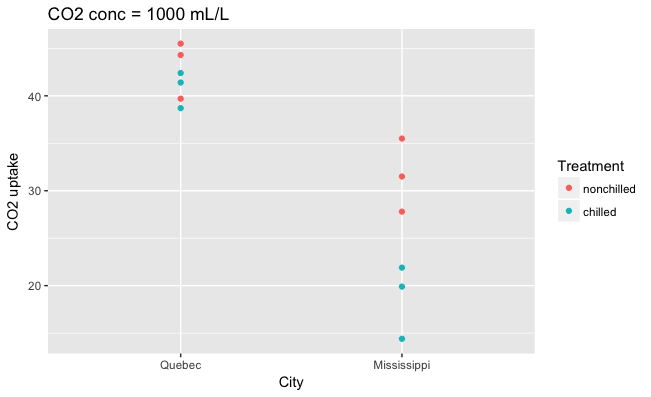
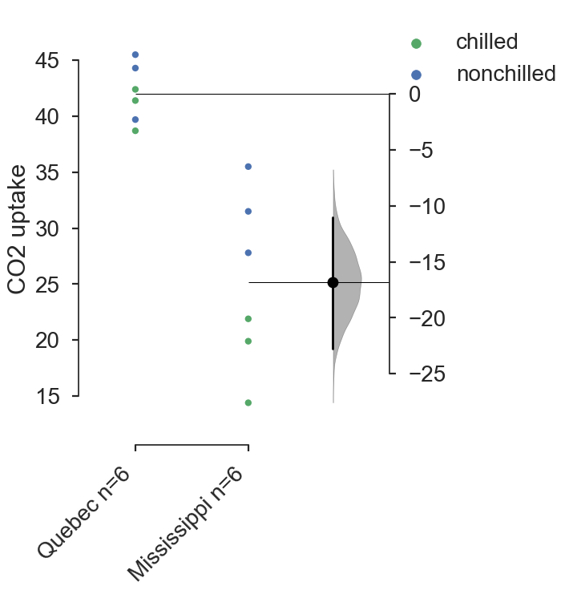

.. _Using `DABEST` in R:
  :linenothreshold: 2
  :dedent: 4

===================
Using DABEST in R
===================

If you haven't already obtained them, install the ``reticulate``, ``dplyr``, and
``ggplot2`` packages for R. From the R console, enter:

.. code-block:: rout

  > install.packages(c('reticulate', 'dplyr', 'ggplot2'))

You will also need to have installed ``dabest`` for Python.
You can do so at the command line.

.. code-block:: bash

  $ pip install dabest

DABEST in the R Console
=======================

Load Data
---------

For this demonstration, we will load the ``CO2`` dataset found in the
``datasets`` package that is bundled with R. This dataset is described
in the `official documentation`_ as follows:

  "The CO\ :sub:`2` uptake of six plants from Quebec and six plants from Mississippi
  was measured at six levels of ambient CO\ :sub:`2` concentration. Half the plants
  of each type were chilled overnight before the experiment was conducted."

.. code-block:: rout

  > library(datasets)
  > head(CO2)

::

  Plant   Type  Treatment conc uptake
  1   Qn1 Quebec nonchilled   95   16.0
  2   Qn1 Quebec nonchilled  175   30.4
  3   Qn1 Quebec nonchilled  250   34.8
  4   Qn1 Quebec nonchilled  350   37.2
  5   Qn1 Quebec nonchilled  500   35.3
  6   Qn1 Quebec nonchilled  675   39.2

Filter and plot the data.
-------------------------

Select readings taken at a CO\ :sub:`2` concentration of 1000 mL/L.

.. code-block:: rout

  > library(dplyr)
  > library(ggplot2)

  > df = filter(CO2, conc == '1000')

  > ggplot(df, aes(x = Type,
                   y = uptake,
                   color = Treatment)) +
      geom_point() +
      ggtitle('CO2 conc = 1000 mL/L') +
      xlab('City') + ylab('CO2 uptake')

Switch to Python and use ``DABEST``.
------------------------------------

Load the package ``reticulate``, which will allow us to load Python packages and
to access Python objects from R. `Read more`_ about this fantastic piece of work!

.. code-block:: rout

  > library(reticulate)

If you are using Anaconda, or are dealing with virtual environments,
you will need to specify the location of the specific Python environment
you are using. Use ``which python`` (Linux/OS X) or ``where python`` (Windows)
at the command line to obtain the correct path.

.. code-block:: rout

  > use_python('/Users/your-username/anaconda3/bin/python')

Using the ``repl_python()`` command, you can start an interactive Python session
from within R.

.. code-block:: rout

  > repl_python()
  Python 3.6.4 (/Users/whho/anaconda3/bin/python)
  Reticulate 1.8 REPL -- A Python interpreter in R.
  >>>

Note the new console prompt ``>>>``.

From the ``reticulate`` `tutorial`_ :

  Access to objects created within R chunks from Python using the r object
  (e.g. r.x would access to x variable created within R from Python)

Thus, whilst in the Python session, use ``r.<variable in R>`` to access
any R object you created above. (This, you have to admit, is pretty cool.)

.. code-block:: python

  >>> import dabest

  >>> f1, results = dabest.plot(data=r.df, fig_size=(5,7),
                                x='Type', y='uptake',
                                swarm_label='CO2 uptake',
                                color_col='Treatment',
                                idx=['Quebec', 'Mississippi'])
  >>> f1.savefig('dabest-plot-CO2.png', bbox_inches='tight')
  >>> exit
  >

A few things to note:

1. It's best to save the generated ``dabest`` plot from within the Python session.

2. You can quickly exit the Python session with (who would have guessed) ``exit``.

Now, you are back in the R session. All the objects generated in Python are
accessible via the ``py`` object; use the ``$`` operator to access named variables.

.. code-block:: rout

  > py$results

::

  reference_group experimental_group stat_summary bca_ci_low bca_ci_high ci
  1          Quebec        Mississippi    -16.83333  -22.98333       -10.9 95
  is_difference is_paired pvalue_2samp_ind_ttest pvalue_mann_whitney
  1          TRUE     FALSE           0.0005511919         0.005074868

Because ``results`` is a Python ``pandas`` object, ``py$results`` is an
R ``data.frame``; its attributes can be accessed easily via the ``$``
operator.

.. code-block:: rout

  > py_results = py$results
  > mean_diff = py_results$stat_summary
  > ci_low = py_results$bca_ci_low
  > ci_high = py_results$bca_ci_high

Print results, with all numerical values formatted to 2 decimal places.

.. code-block:: rout

  > sprintf("Mean Difference = %.2f [95CI %.2f, %.2f]",
            mean_diff, ci_low, ci_high)

::

  [1] "Mean Difference = -16.83 [95CI -22.98, -10.90]"

DABEST in R Markdown
====================

R Markdown is able to run code from different languages `in the same document`_.
From that last link:

  To process a code chunk using an alternate language engine,
  replace the r at the start of your chunk declaration
  with the name of the language.

A minimal example is shown below, and can be downloaded here as an :download:`R Markdown file  <_static/reticulate_tutorial.Rmd>`.

.. image:: _images/dabest-in-r-markdown.png

.. _official documentation: https://stat.ethz.ch/R-manual/R-devel/library/datasets/html/zCO2.html

.. _Read more: https://rstudio.github.io/reticulate/#importing-python-modules

.. _tutorial: https://rstudio.github.io/reticulate/#python-in-r-markdown

.. _in the same document: https://rmarkdown.rstudio.com/lesson-5.html
