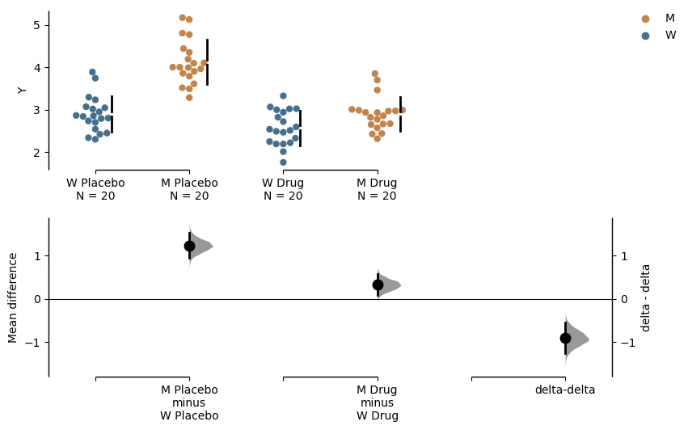
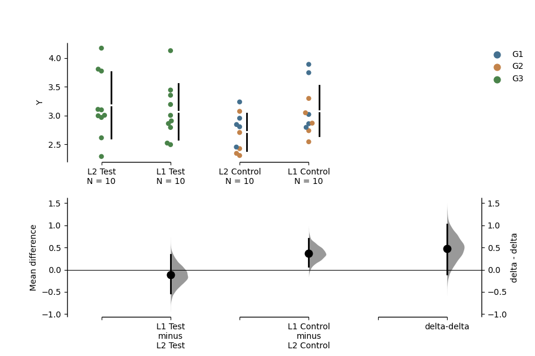
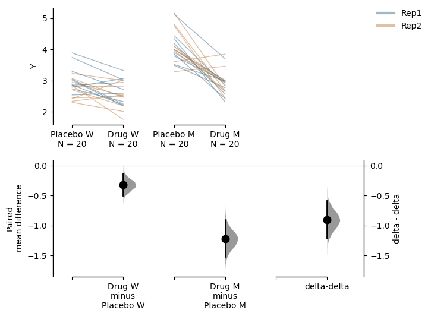
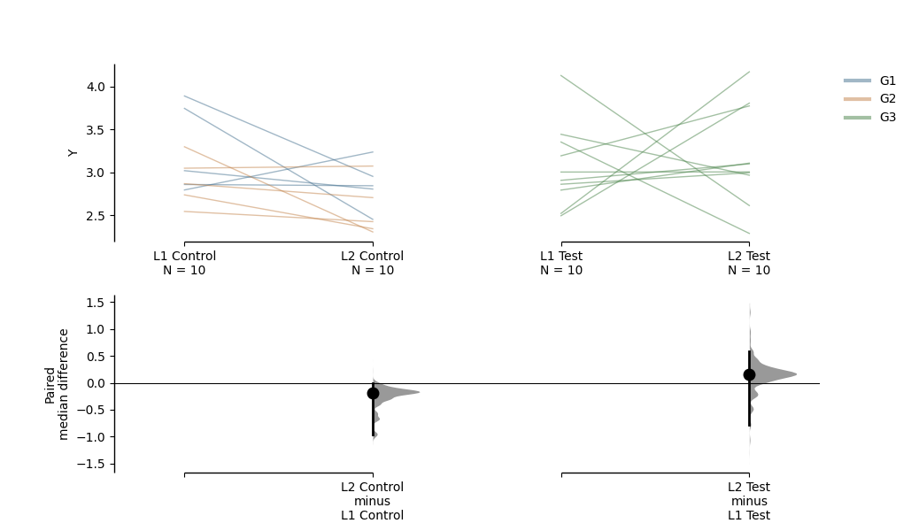
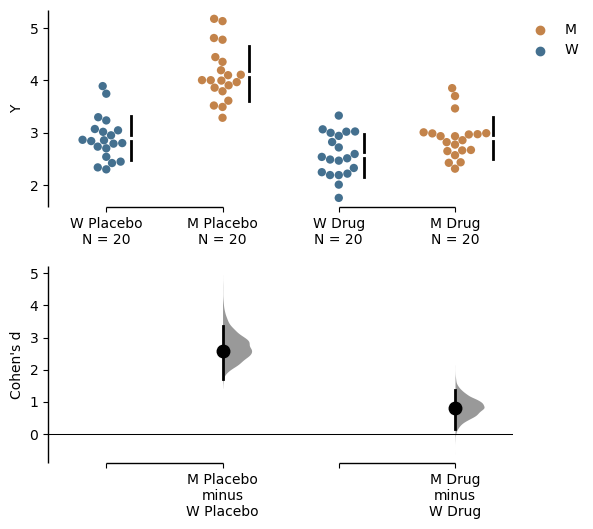

.. _Delta-Delta Tutorial:

=======================
Tutorial: Delta - Delta
=======================

Since version 2023.02.14, DABEST also supports the calculation of delta-delta, an experimental function that allows the comparison between two bootstrapped effect sizes computed from two independent categorical variables. 

Many experimental designs investigate the effects of two interacting independent variables on a dependent variable. The delta-delta effect size lets us distill the net effect of the two variables. To illustrate this, let's delve into the following  problem. 

Consider an experiment where we test the efficacy of a drug named ``Drug`` on a disease-causing mutation ``M`` based on disease metric ``Y``. The greater value ``Y`` has the more severe the disease phenotype is. Phenotype ``Y`` has been shown to be caused by a gain of function mutation ``M``, so we expect a difference between wild type (``W``) subjects and mutant subjects (``M``). Now, we want to know whether this effect is ameliorated by the administration of ``Drug`` treatment. We also administer a placebo as a control. In theory, we only expect ``Drug`` to have an effect on the ``M`` group, although in practice many drugs have non-specific effects on healthy populations too.

Effectively, we have 4 groups of subjects for comparison. 

.. raw:: html

    

    
    <table border="1">

      <thead>
        <tr style="text-align: right;">
          <th></th>
          <th>Wildtype</th>
          <th>Mutant</th>
        </tr>
      </thead>

      <tbody>
        <tr>
          <th>Drug</th>
          <td>XD, W</td>
          <td>XD, M</td>
        </tr>

        <tr>
          <th>Placebo</th>
          <td>XP, W</td>
          <td>XP, M</td>
        </tr>

      </tbody>

    </table>

    

There are 2 ``Treatment`` conditions, ``Placebo`` (control group) and ``Drug`` (test group). There are 2 ``Genotype`` s: ``W`` (wildtype population) and ``M`` (mutant population). In addition, each experiment was done twice (``Rep1`` and ``Rep2``). We shall do a few analyses to visualise these differences in a simulated dataset. 

Simulate a dataset
------------------

.. code-block:: python3
  :linenos:

    import numpy as np
    import pandas as pd
    from scipy.stats import norm # Used in generation of populations.

    np.random.seed(seed) # Fix the seed so the results are replicable.
    # pop_size = 10000 # Size of each population.

    from scipy.stats import norm # Used in generation of populations.

    # Create samples
    y = norm.rvs(loc=3, scale=0.4, size=N*4)
    y[N:2*N] = y[N:2*N]+1
    y[2*N:3*N] = y[2*N:3*N]-0.5

    # Add drug column
    t1 = np.repeat('Placebo', N*2).tolist()
    t2 = np.repeat('Drug', N*2).tolist()
    treatment = t1 + t2 

    # Add a `rep` column as the first variable for the 2 replicates of experiments done
    rep = []
    for i in range(N*2):
        rep.append('Rep1')
        rep.append('Rep2')

    # Add a `genotype` column as the second variable
    wt = np.repeat('W', N).tolist()
    mt = np.repeat('M', N).tolist()
    wt2 = np.repeat('W', N).tolist()
    mt2 = np.repeat('M', N).tolist()

    genotype = wt + mt + wt2 + mt2

    # Add an `id` column for paired data plotting.
    id = list(range(0, N*2))
    id_col = id + id 

    # Combine all columns into a DataFrame.
    df_delta2 = pd.DataFrame({'ID'        : id_col,
                      'Rep'      : rep,
                       'Genotype'  : genotype, 
                       'Drug': treatment,
                       'Y'         : y
                    })

.. code-block:: python3
  :linenos:

    df_delta2.head()

.. raw:: html

 

    
    <table border="1" class="dataframe">
      <thead>
        <tr style="text-align: right;">
          <th></th>
          <th>ID</th>
          <th>Rep</th>
          <th>Genotype</th>
          <th>Treatment</th>
          <th>Y</th>
        </tr>
      </thead>
      <tbody>
        <tr>
          <th>0</th>
          <td>0</td>
          <td>Rep1</td>
          <td>W</td>
          <td>Placebo</td>
          <td>2.793984</td>
        </tr>
        <tr>
          <th>1</th>
          <td>1</td>
          <td>Rep2</td>
          <td>W</td>
          <td>Placebo</td>
          <td>3.236759</td>
        </tr>
        <tr>
          <th>2</th>
          <td>2</td>
          <td>Rep1</td>
          <td>W</td>
          <td>Placebo</td>
          <td>3.019149</td>
        </tr>
        <tr>
          <th>3</th>
          <td>3</td>
          <td>Rep2</td>
          <td>W</td>
          <td>Placebo</td>
          <td>2.804638</td>
        </tr>
        <tr>
          <th>4</th>
          <td>4</td>
          <td>Rep1</td>
          <td>W</td>
          <td>Placebo</td>
          <td>2.858019</td>
        </tr>
      </tbody>
    </table>
    

Unpaired Data
--------------

To make a delta-delta plot, you need to simply set ``delta2 = True`` in the 
``dabest.load()`` function. However, here ``x`` needs to be declared as a list
consisting of 2 elements rather than 1 in most of the cases. The first element
in ``x`` will be the variable plotted along the horizontal axis, and the second
one will determine the colour of dots for scattered plots or the colour of lines
for slopegraphs. We use the ``experiment`` input to specify grouping of the data.

.. code-block:: python3
  :linenos:

    unpaired_delta2 = dabest.load(data = df_delta2, x = ["Genotype", "Genotype"], y = "Y", delta2 = True, 
                experiment = "Drug")

The above function creates the following object: 
    
.. code-block:: python3
  :linenos:

    unpaired_delta2
    
.. parsed-literal::

    DABEST v2023.02.14
    ================

    Good afternoon!
    The current time is Mon Mar  6 16:18:39 2023.

    Effect size(s) with 95% confidence intervals will be computed for:
    1. M Placebo minus W Placebo
    2. M Drug minus W Drug
    3. Drug minus Placebo (only for mean difference)

    5000 resamples will be used to generate the effect size bootstraps.

We can quickly check out the effect sizes:

.. code-block:: python3
  :linenos:

    unpaired_delta2.mean_diff

.. parsed-literal::

    DABEST v2023.02.14
    ================
                
    Good afternoon!
    The current time is Mon Mar  6 16:18:22 2023.

    The unpaired mean difference between W Placebo and M Placebo is 1.23 [95%CI 0.948, 1.52].
    The p-value of the two-sided permutation t-test is 0.0, calculated for legacy purposes only. 

    The unpaired mean difference between W Drug and M Drug is 0.326 [95%CI 0.0934, 0.584].
    The p-value of the two-sided permutation t-test is 0.0122, calculated for legacy purposes only. 

    The delta-delta between Placebo and Drug is -0.903 [95%CI -1.26, -0.535].
    The p-value of the two-sided permutation t-test is 0.0, calculated for legacy purposes only. 

    5000 bootstrap samples were taken; the confidence interval is bias-corrected and accelerated.
    Any p-value reported is the probability of observing the effect size (or greater),
    assuming the null hypothesis of zero difference is true.
    For each p-value, 5000 reshuffles of the control and test labels were performed.

    To get the results of all valid statistical tests, use `.mean_diff.statistical_tests`

.. code-block:: python3
  :linenos:

    unpaired_delta2.mean_diff.plot()

In the above plot, the horizontal axis represents the ``Genotype`` condition
and the dot colour is also specified by ``Genotype``. The left pair of 
scattered plots is based on the ``Placebo`` group while the right pair is based
on the ``Drug`` group. The bottom left axis contains the two primary deltas: the ``Placebo`` delta 
and the ``Drug`` delta. We can easily see that when only the placebo was 
administered, the mutant phenotype is around 1.23 [95%CI 0.948, 1.52]. This difference was shrunken to around 0.326 [95%CI 0.0934, 0.584] when the drug was administered. This gives us some indication that the drug is effective in amiliorating the disease phenotype. Since the ``Drug`` did not completely eliminate the mutant phenotype, we have to calculate how much net effect the drug had. This is where ``delta-delta`` comes in. We use the ``Placebo`` delta as a reference for how much the mutant phenotype is supposed to be, and we subtract the ``Drug`` delta from it. The bootstrapped mean differences (delta-delta) between the ``Placebo`` 
and ``Drug`` group are plotted at the right bottom with a separate y-axis from other bootstrap plots. 
This effect size, at about -0.903 [95%CI -1.26, -0.535], is the net effect size of the drug treatment. That is to say that treatment with drug A reduced disease phenotype by 0.903.

.. math::

    \hat{\theta}_{P} = \overline{X}_{P, M} - \overline{X}_{P, W}

    \hat{\theta}_{D} = \overline{X}_{D, M} - \overline{X}_{D, W}
    
.. math::

    \hat{\theta}_{\theta} = \hat{\theta}_{D} - \hat{\theta}_{P}
    
and:

.. math::

    s_{\theta} = \frac{(n_{P, M}-1)s_{P, M}^2+(n_{P, W}-1)s_{P, W}^2+(n_{D, M}-1)s_{D, M}^2+(n_{D, M}-1)s_{D, M}^2}{(n_{P, M} - 1) + (n_{P, W} - 1) + (n_{D, M} - 1) + (n_{D, M} - 1)}

where :math:`\overline{X}` is the sample mean, :math:`\hat{\theta}` is the mean difference, :math:`s` is the variance and :math:`n` is the sample size.

In the example above, we used the convention of "test - control' but you can manipulate the orders of experiment groups as well as the horizontal axis variable by setting ``experiment_label`` and ``x1_level``.

.. code-block:: python3
  :linenos:

    unpaired_delta2_specified = dabest.load(data = df_delta2, 
                                            x = ["Genotype", "Genotype"], y = "Y", 
                                            delta2 = True, experiment = "Treatment",
                                            experiment_label = ["Drug", "Placebo"],
                                            x1_level = ["M", "W"])

    unpaired_delta2_specified.mean_diff.plot()

Paired Data
-----------

The delta - delta function also supports paired data, which is useful for us to visualise the data in an alternate way. Assuming that the placebo and drug treatment were done on the same subjects, our data is paired between the treatment conditions. We can specify this by using ``Treatment`` as ``x`` and ``Genotype`` as ``experiment``, and we further specify that ``id_col`` is ``ID``, linking data from the same subject with each other. Since we have done two replicates of the experiments, we can also colour the slope lines according to ``Rep``. 

.. code-block:: python3
  :linenos:

    paired_delta2 = dabest.load(data = df_delta2, 
                                paired = "baseline", id_col="ID",
                                x = ["Treatment", "Rep"], y = "Y", 
                                delta2 = True, experiment = "Genotype")
    paired_delta2.mean_diff.plot()

We produce the following plot:

We see that the drug had a non-specific effect of -0.321 [95%CI -0.498, -0.131] on wildtype subjects even when they were not sick, and it had a bigger effect of -1.22 [95%CI -1.52, -0.906] in mutant subjects. In this visualisation, we can see the delta-delta value of -0.903 [95%CI -1.21, -0.587] as the net effect of the drug accounting for non-specific actions in healthy individuals. 

.. math::

    \hat{\theta}_{W} = \overline{X}_{D, W} - \overline{X}_{P, W}

    \hat{\theta}_{W} = \overline{X}_{D, M} - \overline{X}_{P, M}

.. math::

    \hat{\theta}_{\theta} = \hat{\theta}_{M} - \hat{\theta}_{W}
    
and:

.. math::

    s_{\theta} = \frac{(n_{D, W}-1)s_{D, W}^2+(n_{P, W}-1)s_{P, W}^2+(n_{D, M}-1)s_{D, M}^2+(n_{P, M}-1)s_{P, M}^2}{(n_{D, W} - 1) + (n_{P, W} - 1) + (n_{D, M} - 1) + (n_{P, M} - 1)}

where :math:`\overline{X}` is the sample mean, :math:`\hat{\theta}` is the mean difference, :math:`s` is the variance and :math:`n` is the sample size.

Connection to ANOVA
-------------------

The configuration of comparison we performed above is reminiscent of a two-way ANOVA. In fact, the delta - delta is an effect size estimated for the interaction term between ``Treatment`` and ``Genotype``. Main effects of ``Treatment`` and ``Genotype``, on the other hand, can be determined by simpler, univariate contrast plots. 

Omitting Delta-delta Plot
-------------------------
If for some reason you don't want to display the delta-delta plot, you can easily do so by 

.. code-block:: python3
  :linenos:

    unpaired_delta2.mean_diff.plot(show_delta2=False)

Other Effect Sizes
------------------

Since the delta-delta function is only applicable to mean differences, plots 
of other effect sizes will not include a delta-delta bootstrap plot.

.. code-block:: python3
  :linenos:

    unpaired_delta2.cohens_d.plot()

Statistics
------------------

You can find all outputs of the delta - delta calculation by assessing the attribute named ``delta_delta`` of the 
effect size object.

.. code-block:: python3
  :linenos:

    unpaired_delta2.mean_diff.delta_delta

.. parsed-literal::

    DABEST v2023.02.14
    ================
                
    Good afternoon!
    The current time is Mon Mar  6 15:50:44 2023.

    The delta-delta between Placebo and Treatment is -0.903 [95%CI -1.26, -0.535].
    The p-value of the two-sided permutation t-test is 0.0, calculated for legacy purposes only. 

    5000 bootstrap samples were taken; the confidence interval is bias-corrected and accelerated.
    Any p-value reported is the probability of observing the effect size (or greater),
    assuming the null hypothesis of zero difference is true.
    For each p-value, 5000 reshuffles of the control and test labels were performed.

``delta_delta`` has its own attributes, containing various information of delta - delta.

  - ``difference``: the mean bootstrapped differences between the 2 groups of bootstrapped mean differences 
  - ``bootstraps``: the 2 groups of bootstrapped mean differences 
  - ``bootstraps_delta_delta``: the bootstrapped differences between the 2 groups of bootstrapped mean differences 
  - ``permutations``: the mean difference between the two groups of bootstrapped mean differences calculated based on the permutation data
  - ``permutations_var``: the pooled group variances of two groups of bootstrapped mean differences calculated based on permutation data
  - ``permutations_delta_delta``: the delta-delta calculated based on the permutation data

``delta_delta.to_dict()`` will return to you all the attributes in a dictionary format.
