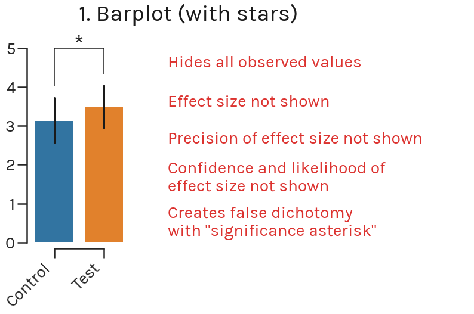
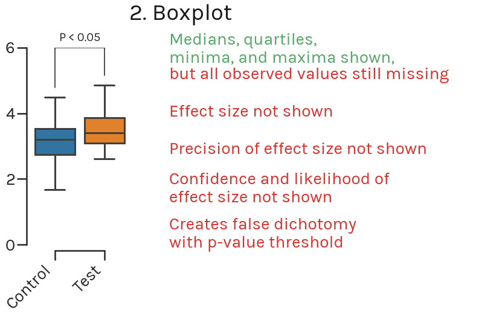
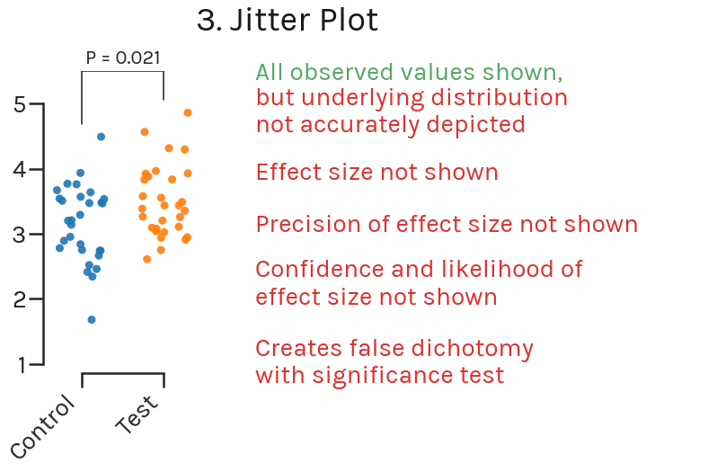
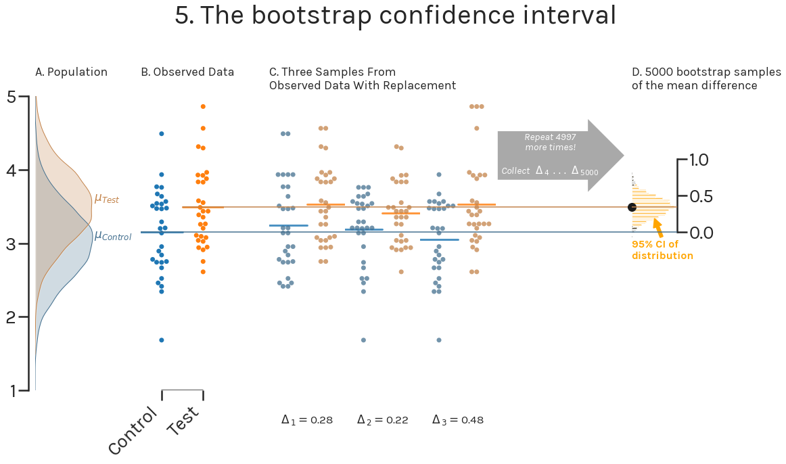
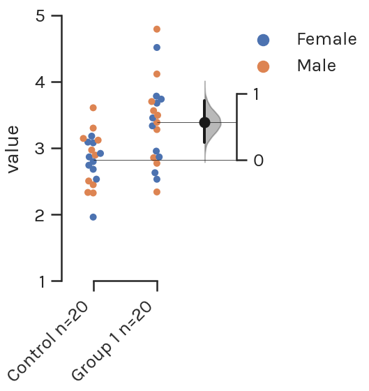
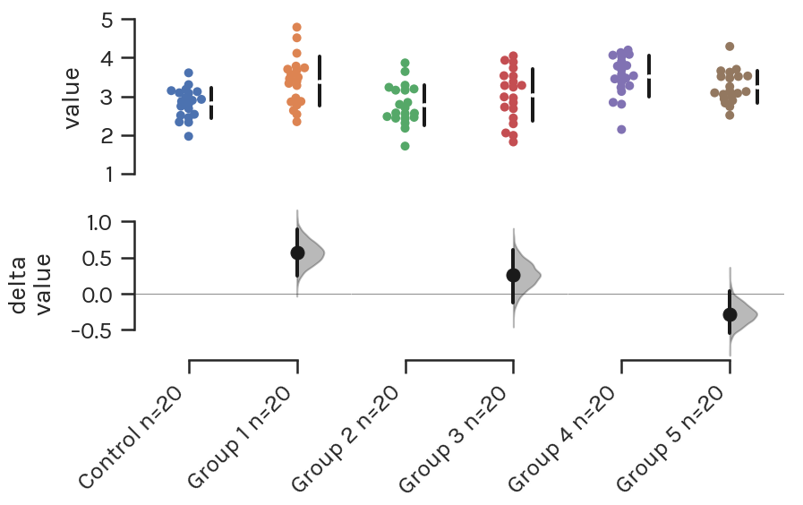
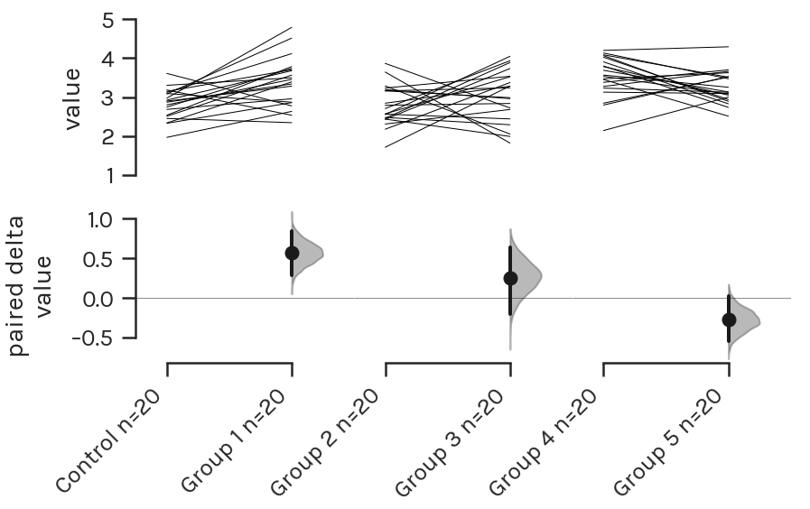
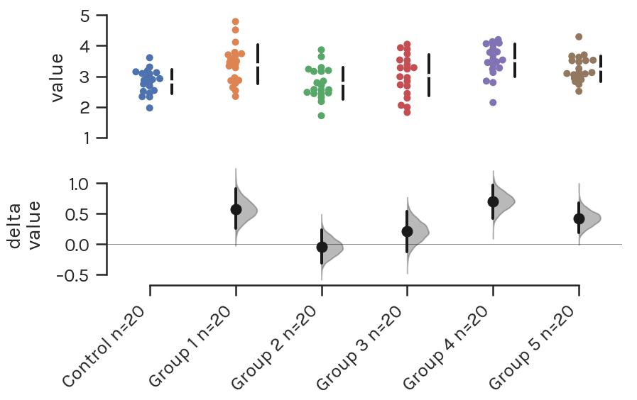

.. _The Estimation Plot:

===================
The Estimation Plot
===================

*IMAGES TO BE UPDATED*

DABEST provides you with plots from an `estimation
statistics <https://en.wikipedia.org/wiki/Estimation_statistics>`__
paradigm. You may have found significance testing and *P* values
`problematic <https://www.nature.com/articles/nmeth.3288>`__; you may be
asking what comes `next <https://doi.org/10.5281/zenodo.60156>`__.

Estimation statistics > *P* Values
----------------------------------

Estimation statistics is a simple
`framework <https://thenewstatistics.com/itns/>`__ that—while avoiding
the pitfalls of significance testing—uses familiar statistical concepts:
means, mean differences, and error bars. More importantly, it focuses on
the effect size of one's experiment/intervention, as opposed to
significance testing.

Significance testing calculates the probability (the P-value) that the
experimental data would be observed, if the intervention did not produce
a change in the metric measured (i.e. the null hypothesis). This leads
analysts to apply a false dichotomy on the experimental intervention.

Estimation statistics, on the other hand, focuses on the magnitude of
the effect (the effect size) and its precision. This encourages analysts
to gain a deeper understanding of the metrics used, and how they relate
to the natural processes being studied.

The Inadequacy of Common Plots
------------------------------

Let's say we have performed an experiment with 30 control subjects, and
30 test subjects. We begin our data analysis by making a barplot of the
data.

The barplot has several shortcomings, despite enjoying widespread usage
in academic journals. We're not the first ones (see
`this <https://www.nature.com/articles/nmeth.2837>`__,
`this <http://journals.plos.org/plosbiology/article?id=10.1371/journal.pbio.1002128>`__,
or
`that <https://onlinelibrary.wiley.com/doi/full/10.1111/ejn.13400>`__)
to point out the myriad flaws with the barplot. Importantly, the barplot
does not show us the effect size.

Instead, we can use a boxplot to visualize the data.

Unfortunately, the boxplot still doesn't show all our data. We still
lack information about the underlying distribution of your data. Is it
normally distributed? Is there skew in the points? What is the sample
size? More importantly, boxplots do not display the effect size.

To display several data points across one or more categories, we can use
the jitter plot.

Jitter plots avoid overlapping datapoints (i.e. datapoints with the same
y-value) by adding a random factor to each point along the orthogonal
x-axes. Thus, while a jitter plot displays all datapoints (implicitly
indicating the sample size visually), it might not accurately depict the
underlying distribution of the data.

Introducing the Estimation Plot
-------------------------------

.. image:: _images/background_17_1.png

An estimation plot has two key features. Firstly, it presents all
datapoints as a swarmplot, which orders each point to display the
underlying distribution. Secondly, an estimation plot presents the
effect size as a *bootstrap 95% confidence interval* on a *separate but
aligned axes*.

We illustrate how bootstrap confidence intervals are generated below.

In a typical scientific experiment, we are attempting to estimate the
mean difference between two populations: µControl and µTest (Figure 5A).
We go about this by obtaining samples from the control population and
from the test population (Figure 5B). We can easily compute the mean
difference in our observed sample (Δ).

**But how do we obtain a measure of precision and confidence about our
observed mean difference, and also get a sense of the population mean
difference?**

We can calculate the 95% confidence interval (95% CI) of the mean
difference by resampling from our observed data several times (Figure
5C). With computers, we can perform 5000 resamples very easily. The mean
difference for each of these resamples is calculated. According to the
`Central Limit
Theorem <https://en.wikipedia.org/wiki/Central_limit_theorem>`__, these
5000 resampled mean differences are normally distributed, allowing easy
derivation of a 95% CI of the mean difference (Figure 5D).

An added benefit of bootstrap confidence intervals is that we do not
need to assume that the population from which our samples come from have
a normal distribution.

The "95%" of the confidence interval refers to the proportion of
confidence intervals that would contain the population mean, if samples
from the population were repeatedly obtained, and confidence intervals
obtained for each sample. That is to say, we can be 95% confident the
interval contains the true mean of the population.

The estimation plot presents Figure 5B and Figure 5D side-by-side as a
single integrated plot. It thus tightly couples visual presentation of
the raw data with an indication of the population mean difference, and
its confidence interval.

A plot for every type of data
-----------------------------

For each of the most routine significance tests, there is an estimation
replacement:

Unpaired Student’s t-test → `Two-group estimation plot <tutorial.html#independent-two-group-estimation-plot>`__

Paired Student’s t-test → `Paired estimation plot <tutorial.html#paired-two-group-estimation-plot>`__

.. image:: _images/background_26_0.png

One-way ANOVA + multiple comparisons → `Multi two-group estimation plot <tutorial.html#multi-two-group-estimation-plot>`__

Repeated measures ANOVA → `Multi paired estimation plot <tutorial.html#multi-two-group-estimation-plot>`__

Ordered groups ANOVA → `Shared-control estimation plot <tutorial.html#shared-control-estimation-plot>`__

All of these plots enable you to graphically inspect the mean difference
and its confidence interval. When there are multiple groups, the
side-by-side plotting allows the visual comparison of effect sizes.

Relative to conventional plots, estimation plots offer five key
benefits:

+------------------------------------+-----------+-----------+----------+-------------------+
|                                    | Barplot   | Boxplot   | Jitter   | Estimation Plot   |
+====================================+===========+===========+==========+===================+
| Displays all observed values       | ✘         | ✘         | ✘        | ✔                 |
+------------------------------------+-----------+-----------+----------+-------------------+
| Displays effect size               | ✘         | ✘         | ✘        | ✔                 |
+------------------------------------+-----------+-----------+----------+-------------------+
| Visualizes estimate precision      | ✘         | ✘         | ✘        | ✔                 |
+------------------------------------+-----------+-----------+----------+-------------------+
| Shows mean difference likelihood   | ✘         | ✘         | ✘        | ✔                 |
+------------------------------------+-----------+-----------+----------+-------------------+
| Avoids false dichotomy             | ✘         | ✘         | ✘        | ✔                 |
+------------------------------------+-----------+-----------+----------+-------------------+

To our knowledge, mean difference estimation plots were first described
by Martin Gardner and Douglas Altman (`Gardner and Altman
1986 <https://www.ncbi.nlm.nih.gov/pmc/articles/PMC1339793/pdf/bmjcred00225-0036.pdf>`__),
while the multiple-comparison design was devised by Geoff Cumming
(`Cumming 2012 <https://thenewstatistics.com/itns/>`__).
