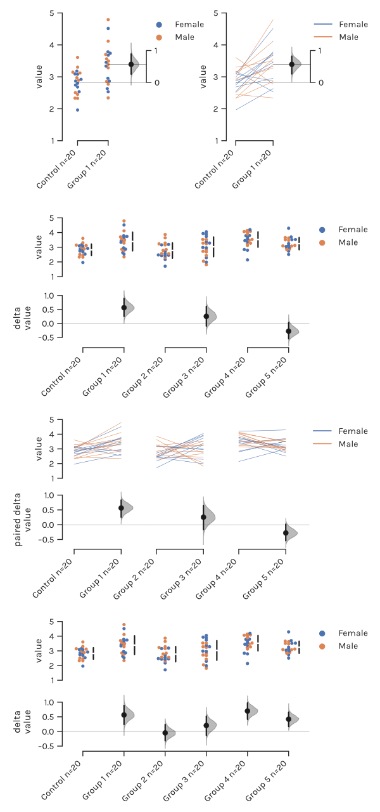

.. dabest documentation master file, created by
   sphinx-quickstart on Tue Dec 12 10:37:08 2017.
   You can adapt this file completely to your liking, but it should at least
   contain the root `toctree` directive

======
DABEST
======
-----------------------------------------------
Data Analysis with Bootstrap-coupled ESTimation
-----------------------------------------------
*version 0.2.0*

Analyze your data with estimation statistics!
---------------------------------------------

News
----
March 2019:
  - Release of v0.2.0. This is a major update that makes several breaking changes to the API. See the :doc:`release-notes`.

January 2019:
  - Release of v0.1.7. Added `cumming_vertical_spacing` option.

October 2018:
  - Release of v0.1.6. Added more keywords for control of plot elements.

July 2018:
 - Release of v0.1.5. *bugfix for setup and package management*
 - Release of v0.1.4.

June 2018:
  - Release of v0.1.3. Also added a short tutorial for dabest in R.

December 2017:
  - We have made a `webapp <https://www.estimationstats.com>`_ that produces Gardner-Altman and Cumming plots!

Contents
--------

.. toctree::
   :maxdepth: 2

   estimation-plots
   getting-started
   tutorial
   release-notes
   api
   about
