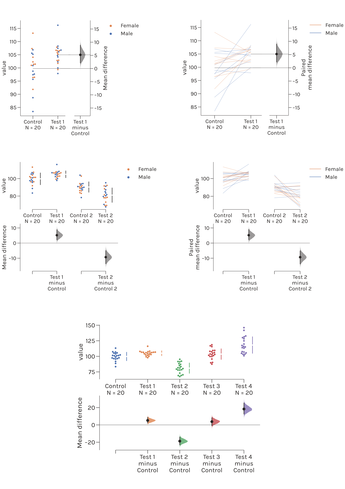

.. dabest documentation master file.
   You can adapt this file completely to your liking, but it should at least
   contain the root `toctree` directive

======
DABEST
======

-----------------------------------------------
Data Analysis with Bootstrap-coupled ESTimation
-----------------------------------------------

Analyze your data with estimation statistics!
---------------------------------------------

News
----
May 2019:
  - v0.2.3 released. This is a fix for a bug that did not properly handle x-columns which were pandas Categorical objects. See the :doc:`release-notes`.

April 2019:
  - v0.2.2 released. This is a minor bugfix that addressed an issue for an edge case where the mean or median difference was exactly zero.
  
March 2019:
  - v0.2.1 released. This is a minor bugfix that addressed an issue in gapped line plotting.
  - v0.2.0 released. This is a major update that makes several breaking changes to the API. 
  
Contents
--------

.. toctree::
   :maxdepth: 2

   robust-beautiful
   bootstraps
   getting-started
   tutorial
   release-notes
   api
   about
