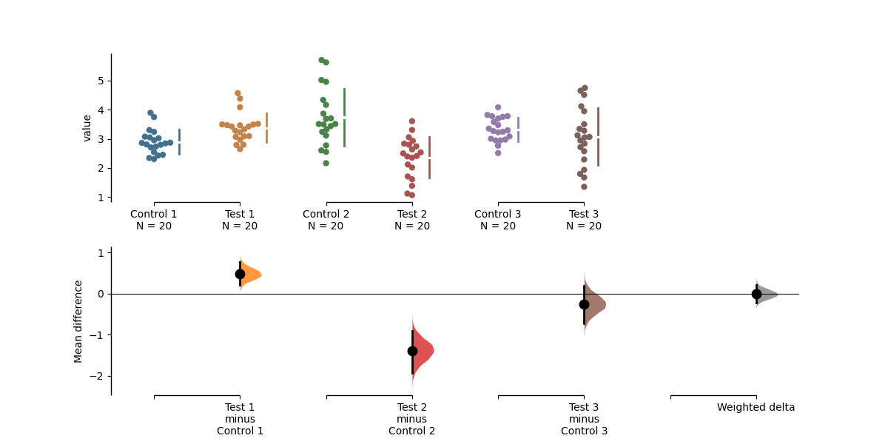
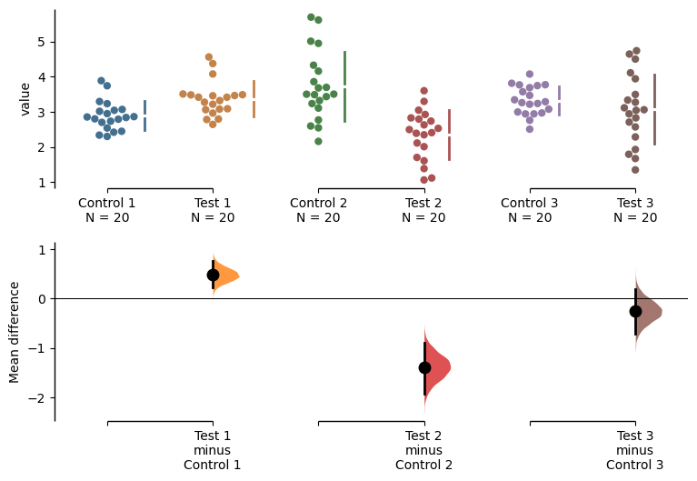
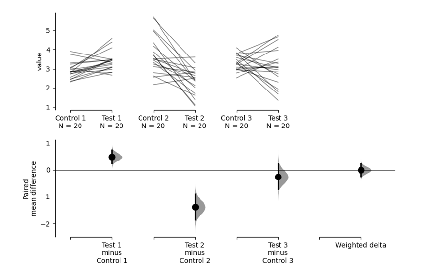

.. _Mini-Meta Delta Tutorial:

=========================
Tutorial: Mini-Meta Delta
=========================

When scientists perform replicates of the same experiment, the effect size of each replicate often varies, which complicates interpretation of the results. As of v2023.02.14, DABEST can now compute the meta-analyzed weighted effect size given multiple replicates of the same experiment. This can help resolve differences between replicates and simplify interpretation.

This function uses the generic *inverse-variance* method to calculate the effect size, as follows:

.. math::
	\theta_{\text{weighted}} = \frac{\Sigma\hat{\theta_{i}}w_{i}}{{\Sigma}w_{i}}

where:

.. math::
	\hat{\theta_{i}} = \text{Mean difference for replicate }i 

.. math::
	w_{i} = \text{Weight for replicate }i = \frac{1}{s_{i}^2} 

.. math::
	s_{i}^2 = \text{Pooled variance for replicate }i = \frac{(n_{test}-1)s_{test}^2+(n_{control}-1)s_{control}^2}{n_{test}+n_{control}-2}

.. math::
	n = \text{sample size and }s^2 = \text{variance for control/test.}

Note that this uses the *fixed-effects* model of meta-analysis, as opposed to the random-effects model; that is to say, all variation between the results of each replicate is assumed to be due solely to sampling error. We thus recommend that this function only be used for replications of the same experiment, i.e. situations where it can be safely assumed that each replicate estimates the same population mean :math:`\mu`. 

Also note that as of v2023.02.14, DABEST can only compute weighted effect size *for mean difference only*, and not standardized measures such as Cohen's *d*.

For more information on meta-analysis, please refer to Chapter 10 of the Cochrane handbook: https://training.cochrane.org/handbook/current/chapter-10

Load Libraries
--------------

.. code-block:: python3
  :linenos:

    import numpy as np
    import pandas as pd
    import dabest

    print("We're using DABEST v{}".format(dabest.__version__))

.. parsed-literal::

    We're using DABEST v2023.02.14

Create dataset for mini-meta demo
---------------------------------

We will now create a dataset to demonstrate the mini-meta function.

.. code-block:: python3
  :linenos:

    from scipy.stats import norm # Used in generation of populations.

    np.random.seed(9999) # Fix the seed so the results are replicable.
    # pop_size = 10000 # Size of each population.
    Ns = 20 # The number of samples taken from each population

    # Create samples
    c1 = norm.rvs(loc=3, scale=0.4, size=Ns)
    c2 = norm.rvs(loc=3.5, scale=0.75, size=Ns)
    c3 = norm.rvs(loc=3.25, scale=0.4, size=Ns)

    t1 = norm.rvs(loc=3.5, scale=0.5, size=Ns)
    t2 = norm.rvs(loc=2.5, scale=0.6, size=Ns)
    t3 = norm.rvs(loc=3, scale=0.75, size=Ns)

    # Add a `gender` column for coloring the data.
    females = np.repeat('Female', Ns/2).tolist()
    males = np.repeat('Male', Ns/2).tolist()
    gender = females + males

    # Add an `id` column for paired data plotting.
    id_col = pd.Series(range(1, Ns+1))

    # Combine samples and gender into a DataFrame.
    df = pd.DataFrame({'Control 1' : c1,     'Test 1' : t1,
                       'Control 2' : c2,     'Test 2' : t2,
                       'Control 3' : c3,     'Test 3' : t3,
                       'Gender'    : gender, 'ID'  : id_col
                      })

We now have 3 Control and 3 Test groups, simulating 3 replicates of the same experiment. Our
dataset also has a non-numerical column indicating gender, and another
column indicating the identity of each observation.

This is known as a ‘wide’ dataset. See this
`writeup <https://sejdemyr.github.io/r-tutorials/basics/wide-and-long/>`__
for more details.

.. code-block:: python3
  :linenos:

    df.head()

.. raw:: html

    

    
    <table border="1" class="dataframe">
      <thead>
        <tr style="text-align: right;">
          <th></th>
          <th>Control 1</th>
          <th>Test 1</th>
          <th>Control 2</th>
          <th>Test 2</th>
          <th>Control 3</th>
          <th>Test 3</th>
          <th>Gender</th>
          <th>ID</th>
        </tr>
      </thead>
      <tbody>
        <tr>
          <th>0</th>
          <td>2.793984</td>
          <td>3.420875</td>
          <td>3.324661</td>
          <td>1.707467</td>
          <td>3.816940</td>
          <td>1.796581</td>
          <td>Female</td>
          <td>1</td>
        </tr>
        <tr>
          <th>1</th>
          <td>3.236759</td>
          <td>3.467972</td>
          <td>3.685186</td>
          <td>1.121846</td>
          <td>3.750358</td>
          <td>3.944566</td>
          <td>Female</td>
          <td>2</td>
        </tr>
        <tr>
          <th>2</th>
          <td>3.019149</td>
          <td>4.377179</td>
          <td>5.616891</td>
          <td>3.301381</td>
          <td>2.945397</td>
          <td>2.832188</td>
          <td>Female</td>
          <td>3</td>
        </tr>
        <tr>
          <th>3</th>
          <td>2.804638</td>
          <td>4.564780</td>
          <td>2.773152</td>
          <td>2.534018</td>
          <td>3.575179</td>
          <td>3.048267</td>
          <td>Female</td>
          <td>4</td>
        </tr>
        <tr>
          <th>4</th>
          <td>2.858019</td>
          <td>3.220058</td>
          <td>2.550361</td>
          <td>2.796365</td>
          <td>3.692138</td>
          <td>3.276575</td>
          <td>Female</td>
          <td>5</td>
        </tr>
      </tbody>
    </table>
    

Loading Data
------------

Next, we load data as we would normally using ``dabest.load()``. This time, however,
we also specify the argument ``mini_meta=True``. As we are loading three experiments' worth of data,
``idx`` is passed as a tuple of tuples, as follows:

.. code-block:: python3
  :linenos:

    unpaired = dabest.load(df, idx=(("Control 1", "Test 1"), ("Control 2", "Test 2"), ("Control 3", "Test 3")), mini_meta=True)

When this ``Dabest`` object is called, it should show that effect sizes will be calculated for each group, as well as the weighted delta. Note once again that weighted delta will only be calcuated for mean difference.

.. code-block:: python3
  :linenos:

    unpaired

.. parsed-literal::

    DABEST v2023.02.14
    ==================
                
    Good evening!
    The current time is Sun Aug 29 18:00:54 2021.

    Effect size(s) with 95% confidence intervals will be computed for:
    1. Test 1 minus Control 1
    2. Test 2 minus Control 2
    3. Test 3 minus Control 3
    4. weighted delta (only for mean difference)

    5000 resamples will be used to generate the effect size bootstraps.

By calling the ``mean_diff`` attribute, you can view the mean differences for each group as well as the weighted delta.

.. code-block:: python3
  :linenos:

    unpaired.mean_diff

.. parsed-literal::

	DABEST v2023.02.14
	==================
             
	Good evening!
	The current time is Sun Feb 26 18:40:41 2023.

	The unpaired mean difference between Control 1 and Test 1 is 0.48 [95%CI 0.221, 0.768].
	The p-value of the two-sided permutation t-test is 0.001, calculated for legacy purposes only. 

	The unpaired mean difference between Control 2 and Test 2 is -1.38 [95%CI -1.93, -0.895].
	The p-value of the two-sided permutation t-test is 0.0, calculated for legacy purposes only. 

	The unpaired mean difference between Control 3 and Test 3 is -0.255 [95%CI -0.717, 0.196].
	The p-value of the two-sided permutation t-test is 0.293, calculated for legacy purposes only. 

	The weighted-average unpaired mean differences is -0.0104 [95%CI -0.222, 0.215].
	The p-value of the two-sided permutation t-test is 0.937, calculated for legacy purposes only. 

	5000 bootstrap samples were taken; the confidence interval is bias-corrected and accelerated.
	Any p-value reported is the probability of observing theeffect size (or greater),
	assuming the null hypothesis ofzero difference is true.
	For each p-value, 5000 reshuffles of the control and test labels were performed.

	To get the results of all valid statistical tests, use `.mean_diff.statistical_tests`

You can view the details of each experiment by accessing `.mean_diff.results`, as follows.

.. code-block:: python3
  :linenos:

    pd.options.display.max_columns = 50
    unpaired.mean_diff.results

.. raw:: html

    

    
    <table border="1" class="dataframe">
      <thead>
        <tr style="text-align: right;">
          <th></th>
          <th>control</th>
          <th>test</th>
          <th>control_N</th>
          <th>test_N</th>
          <th>effect_size</th>
          <th>difference</th>
          <th>ci</th>
          <th>bca_low</th>
          <th>bca_high</th>
          <th>bca_interval_idx</th>
          <th>pct_low</th>
          <th>pct_high</th>
          <th>pct_interval_idx</th>
          <th>bootstraps</th>
          <th>resamples</th>
          <th>random_seed</th>
          <th>permutations</th>
          <th>pvalue_permutation</th>
          <th>permutation_count</th>
          <th>permutations_var</th>
          <th>pvalue_welch</th>
          <th>statistic_welch</th>
          <th>pvalue_students_t</th>
          <th>statistic_students_t</th>
          <th>pvalue_mann_whitney</th>
          <th>statistic_mann_whitney</th>
        </tr>
      </thead>
      <tbody>
        <tr>
          <th>0</th>
          <td>Control 1</td>
          <td>Test 1</td>
          <td>20</td>
          <td>20</td>
          <td>mean difference</td>
          <td>0.48029</td>
          <td>95</td>
          <td>0.220869</td>
          <td>0.767721</td>
          <td>(140, 4889)</td>
          <td>0.215697</td>
          <td>0.761716</td>
          <td>(125, 4875)</td>
          <td>[0.6686169333655454, 0.4382051534234943, 0.665...</td>
          <td>5000</td>
          <td>12345</td>
          <td>[-0.17259843762502491, 0.03802293852634886, -0...</td>
          <td>0.001</td>
          <td>5000</td>
          <td>[0.026356588154404337, 0.027102495439046997, 0...</td>
          <td>0.002094</td>
          <td>-3.308806</td>
          <td>0.002057</td>
          <td>-3.308806</td>
          <td>0.001625</td>
          <td>83.0</td>
        </tr>
	<tr>
          <th>1</th>
          <td>Control 2</td>
          <td>Test 2</td>
          <td>20</td>
          <td>20</td>
          <td>mean difference</td>
          <td>-1.381085</td>
          <td>95</td>
          <td>-1.925232</td>
          <td>-0.894537</td>
          <td>(108, 4857)</td>
          <td>-1.903964</td>
          <td>-0.875420</td>
          <td>(125, 4875)</td>
          <td>[-1.1603841133810318, -1.6359724856206515, -1....</td>
          <td>5000</td>
          <td>12345</td>
          <td>[0.015164519971271773, 0.017231919606192303, -...</td>
          <td>0.0000</td>
          <td>5000</td>
          <td>[0.12241741427801064, 0.12241565174150129, 0.1...</td>
          <td>0.000011</td>
          <td>5.138840</td>
          <td>0.000009</td>
          <td>5.138840</td>
          <td>0.000026</td>
          <td>356.0</td>
        </tr>
	<tr>
          <th>2</th>
          <td>Control 3</td>
          <td>Test 3</td>
          <td>20</td>
          <td>20</td>
          <td>mean difference</td>
          <td>-0.254831</td>
          <td>95</td>
          <td>-0.717337</td>
          <td>0.196121</td>
          <td>(115, 4864)</td>
          <td>-0.710346</td>
          <td>0.206131</td>
          <td>(125, 4875)</td>
          <td>[-0.09556572841011901, 0.35166073097757433, -0...</td>
          <td>5000</td>
          <td>12345</td>
          <td>[-0.05901068591042824, -0.13617667681797307, 0...</td>
          <td>0.2934</td>
          <td>5000</td>
          <td>[0.058358897501663703, 0.05796253365278035, 0....</td>
          <td>0.294766</td>
          <td>1.069798</td>
          <td>0.291459</td>
          <td>1.069798</td>
          <td>0.285305</td>
          <td>240.0</td>
        </tr>
      </tbody>
    </table>
    

Note, however, that this does not contain the relevant information for our weighted delta. The details of the weighted delta are stored as attributes of the ``mini_meta_delta`` object, for example:

  - ``group_var``: the pooled group variances of each set of 2 experiment groups
  - ``difference``: the weighted mean difference calculated based on the raw data
  - ``bootstraps``: the deltas of each set of 2 experiment groups calculated based on the bootstraps
  - ``bootstraps_weighted_delta``: the weighted deltas calculated based on the bootstraps
  - ``permutations``: the deltas of each set of 2 experiment groups calculated based on the permutation data
  - ``permutations_var``: the pooled group variances of each set of 2 experiment groups calculated based on permutation data
  - ``permutations_weighted_delta``: the weighted deltas calculated based on the permutation data

You can call each of the above attributes on their own:

.. code-block:: python3
  :linenos:

    unpaired.mean_diff.mini_meta_delta.difference

.. parsed-literal::

    -0.010352

Attributes of the weighted delta can also be written to a `dict` by using the ``.to_dict()`` function. Below, we do this and subsequently convert the dict into a dataframe for better readability:

.. code-block:: python3
  :linenos:

    weighted_delta_details = unpaired.mean_diff.mini_meta_delta.to_dict()
    weighted_delta_df = pd.DataFrame.from_dict(weighted_delta_details, orient = 'index')
    weighted_delta_df

.. raw:: html

    

    
    <table border="1" class="dataframe">
      <thead>
        <tr style="text-align: right;">
          <th></th>
          <th>0</th>
        </tr>
      </thead>
      <tbody>
        <tr>
          <th>acceleration_value</th>
          <td>0.000193</td>
        </tr>
        <tr>
          <th>alpha</th>
          <td>0.05</td>
        </tr>
        <tr>
          <th>bca_high</th>
          <td>0.215037</td>
        </tr>
        <tr>
          <th>bca_interval_idx</th>
          <td>(128, 4878)</td>
        </tr>
        <tr>
          <th>bca_low</th>
          <td>-0.221666</td>
        </tr>
        <tr>
          <th>bias_correction</th>
          <td>0.005013</td>
        </tr>
        <tr>
          <th>bootstraps</th>
          <td>[[0.6686169333655454, 0.4382051534234943, 0.66...</td>
        </tr>
        <tr>
          <th>bootstraps_weighted_delta</th>
          <td>[0.1771640316740503, 0.055052653330973, 0.1635...</td>
        </tr>
        <tr>
          <th>ci</th>
          <td>95</td>
        </tr>
        <tr>
          <th>control</th>
          <td>[Control 1, Control 2, Control 3]</td>
        </tr>
        <tr>
          <th>control_N</th>
          <td>[20, 20, 20]</td>
        </tr>
        <tr>
          <th>control_var</th>
          <td>[0.17628013404546256, 0.9584767911266554, 0.16...</td>
        </tr>
        <tr>
          <th>difference</th>
          <td>-0.010352</td>
        </tr>
        <tr>
          <th>group_var</th>
          <td>[0.021070042637349427, 0.07222883451891535, 0....</td>
        </tr>
        <tr>
          <th>jackknives</th>
          <td>[-0.008668330406027464, -0.008643903244926629,...</td>
        </tr>
        <tr>
          <th>pct_high</th>
          <td>0.213769</td>
        </tr>
        <tr>
          <th>pct_interval_idx</th>
          <td>(125, 4875)</td>
        </tr>
        <tr>
          <th>pct_low</th>
          <td>-0.222307</td>
        </tr>
        <tr>
          <th>permutation_count</th>
          <td>5000</td>
        </tr>
        <tr>
          <th>permutations</th>
          <td>[[-0.17259843762502491, 0.03802293852634886, -...</td>
        </tr>
        <tr>
          <th>permutations_var</th>
          <td>[[0.026356588154404337, 0.027102495439046997, ...</td>
        </tr>
        <tr>
          <th>permutations_weighted_delta</th>
          <td>[-0.11757207833491819, -0.012928679700934625, ...</td>
        </tr>
        <tr>
          <th>pvalue_permutation</th>
          <td>0.9374</td>
        </tr>
        <tr>
          <th>test</th>
          <td>[Test 1, Test 2, Test 3]</td>
        </tr>
        <tr>
          <th>test_N</th>
          <td>[20, 20, 20]</td>
        </tr>
        <tr>
          <th>test_var</th>
          <td>[0.245120718701526, 0.4860998992516514, 0.9667...</td>
        </tr>
      </tbody>
    </table>
    

Producing estimation plots - unpaired data
------------------------------------------

Simply passing the ``.plot()`` method will produce a **Cumming estimation plot** showing the data for each experimental replicate as well as the calculated weighted delta.

.. code-block:: python3
  :linenos:

  unpaired.mean_diff.plot()

You can also hide the weighted delta by passing the argument ``show_mini_meta=False``. In this case, the resulting graph would be identical to a multiple two-groups plot:

.. code-block:: python3
   :linenos:

   unpaired.mean_diff.plot(show_mini_meta=False)

Producing estimation plots - paired data
------------------------------------------

The tutorial up to this point has dealt with unpaired data. If your data is paired data, the process for loading, plotting and accessing the data is the same as for unpaired data, except the argument ``paired = "sequential" or "baseline"`` and an appropriate ``id_col`` are passed during the ``dabest.load()`` step, as follows:
 
.. code-block:: python3
  :linenos:

  paired = dabest.load(df, idx=(("Control 1", "Test 1"), ("Control 2", "Test 2"), ("Control 3", "Test 3")), mini_meta=True, id_col="ID", paired="baseline")
  paired.mean_diff.plot()

