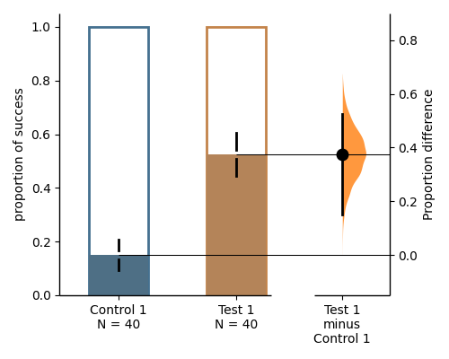
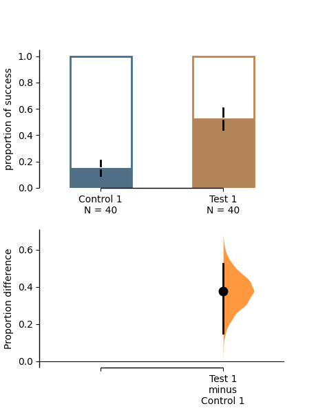
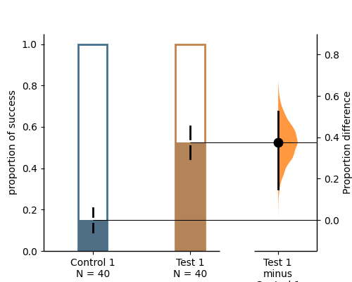

.. _Proportion Plot:

===============
Proportion Plot
===============

It's important to note that the code we provided only supports numerical proportion data, 
where the values are limited to 0 and 1. This means that the code may not be suitable for 
analyzing proportion data that contains non-numeric values, such as strings like 'yes' and 'no'.

Create dataset for demo
-----------------------

.. code-block:: python3
  :linenos:

    import numpy as np
    import pandas as pd

    np.random.seed(9999) # Fix the seed so the results are replicable.
    Ns = 40 # The number of samples taken from each population

    # Create samples
    n = 1
    c1 = np.random.binomial(n, 0.2, size=N)
    c2 = np.random.binomial(n, 0.2, size=N)
    c3 = np.random.binomial(n, 0.8, size=N)

    t1 = np.random.binomial(n, 0.5, size=N)
    t2 = np.random.binomial(n, 0.2, size=N)
    t3 = np.random.binomial(n, 0.3, size=N)
    t4 = np.random.binomial(n, 0.4, size=N)
    t5 = np.random.binomial(n, 0.5, size=N)
    t6 = np.random.binomial(n, 0.6, size=N)

    # Add a `gender` column for coloring the data.
    females = np.repeat('Female', N / 2).tolist()
    males = np.repeat('Male', N / 2).tolist()
    gender = females + males

    # Add an `id` column for paired data plotting.
    id_col = pd.Series(range(1, N + 1))

    # Combine samples and gender into a DataFrame.
    df = pd.DataFrame({'Control 1': c1, 'Test 1': t1,
                       'Control 2': c2, 'Test 2': t2,
                       'Control 3': c3, 'Test 3': t3,
                       'Test 4': t4, 'Test 5': t5, 'Test 6': t6,
                       'Gender': gender, 'ID': id_col
                       })

    .. code-block:: python3
  :linenos:

    df.head()

.. raw:: html

    

    
    <table border="1" class="dataframe">
        <thead>
            <tr style="text-align: right;">
                <th></th>
                <th>Control 1</th>
                <th>Test 1</th>
                <th>Control 2</th>
                <th>Test 2</th>
                <th>Control 3</th>
                <th>Test 3</th>
                <th>Test 4</th>
                <th>Test 5</th>
                <th>Test 6</th>
                <th>Gender</th>
                <th>ID</th>
            </tr>
        </thead>
        <tbody>
            <tr>
                <td>0</td>
                <td>1</td>
                <td>0</td>
                <td>0</td>
                <td>0</td>
                <td>1</td>
                <td>1</td>
                <td>0</td>
                <td>0</td>
                <td>1</td>
                <td>Female</td>
                <td>1</td>
            </tr>
            <tr>
                <td>1</td>
                <td>0</td>
                <td>0</td>
                <td>0</td>
                <td>1</td>
                <td>0</td>
                <td>1</td>
                <td>1</td>
                <td>0</td>
                <td>0</td>
                <td>Female</td>
                <td>2</td>
            </tr>
            <tr>
                <td>2</td>
                <td>0</td>
                <td>1</td>
                <td>0</td>
                <td>1</td>
                <td>1</td>
                <td>1</td>
                <td>0</td>
                <td>1</td>
                <td>1</td>
                <td>Female</td>
                <td>3</td>
            </tr>
            <tr>
                <td>3</td>
                <td>0</td>
                <td>0</td>
                <td>0</td>
                <td>0</td>
                <td>1</td>
                <td>0</td>
                <td>0</td>
                <td>1</td>
                <td>0</td>
                <td>Female</td>
                <td>4</td>
            </tr>
            <tr>
                <td>4</td>
                <td>0</td>
                <td>0</td>
                <td>0</td>
                <td>0</td>
                <td>1</td>
                <td>1</td>
                <td>1</td>
                <td>0</td>
                <td>1</td>
                <td>Female</td>
                <td>5</td>
            </tr>
        </tbody>
    </table>
    

Loading Data
------------

When loading data, specify ``proportional=True``.

.. code-block:: python3
  :linenos:

    two_groups_unpaired = dabest.load(df, idx=("Control 1", "Test 1"), proportional=True)

.. code-block:: python3
  :linenos:

    two_groups_unpaired

.. parsed-literal::
    DABEST v0.3.1
    =============
                
    Good evening!
    The current time is Tue Feb 20 22:49:54 2023.

    Effect size(s) with 95% confidence intervals will be computed for:
    1. Test 1 minus Control 1

    5000 resamples will be used to generate the effect size bootstraps.

Effect sizes
------------

For proportion plot, dabest features two effect sizes:
  - the mean difference (``mean_diff``)
  - `Cohen’s h <https://en.wikipedia.org/wiki/Cohen%27s_h>`__ (``cohens_h``)

Each of these are attributes of the ``Dabest`` object.

.. code-block:: python3
  :linenos:

    two_groups_unpaired.mean_diff

.. parsed-literal::
    DABEST v0.3.1
    =============
                
    Good evening!
    The current time is Tue Feb 20 22:55:04 2023.

    DABEST v0.3.1
    =============
                
    Good evening!
    The current time is Tue Feb 21 22:55:04 2023.

    The unpaired mean difference between Control 1 and Test 1 is 0.341 [95%CI 0.274, 0.403].
    The p-value of the two-sided permutation t-test is 0.0, calculated for legacy purposes only. 

    5000 bootstrap samples were taken; the confidence interval is bias-corrected and accelerated.
    Any p-value reported is the probability of observing theeffect size (or greater),
    assuming the null hypothesis ofzero difference is true.
    For each p-value, 5000 reshuffles of the control and test labels were performed.

    To get the results of all valid statistical tests, use `.mean_diff.statistical_tests`

    To get the results of all valid statistical tests, use `.mean_diff.statistical_tests`

Let’s compute the Cohen's h for our comparison.

.. code-block:: python3
  :linenos:

  two_groups_unpaired.cohens_h

.. parsed-literal::

    DABEST v0.3.1
    =============
                
    Good evening!
    The current time is Tue Feb 20 22:57:31 2023.

    DABEST v0.3.1
    =============
                
    Good evening!
    The current time is Tue Feb 21 22:57:31 2023.

    The unpaired Cohen's h between Control 1 and Test 1 is 0.758 [95%CI 0.603, 0.906].
    The p-value of the two-sided permutation t-test is 0.0, calculated for legacy purposes only. 

    5000 bootstrap samples were taken; the confidence interval is bias-corrected and accelerated.
    Any p-value reported is the probability of observing theeffect size (or greater),
    assuming the null hypothesis ofzero difference is true.
    For each p-value, 5000 reshuffles of the control and test labels were performed.

    To get the results of all valid statistical tests, use `.cohens_h.statistical_tests`

    To get the results of all valid statistical tests, use `.cohens_h.statistical_tests`

Producing estimation plots
--------------------------

To produce a **Gardner-Altman estimation plot**, simply use the
``.plot()`` method. 

Every effect size instance has access to the ``.plot()`` method. This
means you can quickly create plots for different effect sizes easily.

.. code-block:: python3
  :linenos:

  two_groups_unpaired.mean_diff.plot();

.. code-block:: python3
  :linenos:

    two_groups_unpaired.cohens_h.plot();

.. image:: _images/prop_2.png

The white part in the bar represents the proportion of observations in the dataset that do not belong to the category, which is 
equivalent to the proportion of 0 in the data. The colored part, on the other hand, represents the proportion of observations 
that belong to the category, which is equivalent to the proportion of 1 in the data. By default, the value of 'group_summaries' 
is set to "mean_sd". This means that the error bars in the plot display the mean and ± standard deviation of each group as 
gapped lines. The gap represents the mean, while the vertical ends represent the standard deviation. Alternatively, if the 
value of 'group_summaries' is set to "median_quartiles", the median and 25th and 75th percentiles of each group are plotted instead. 
By default, the bootstrap effect sizes is plotted on the right axis.

Instead of a Gardner-Altman plot, you can produce a **Cumming estimation
plot** by setting ``float_contrast=False`` in the ``plot()`` method.
This will plot the bootstrap effect sizes below the raw data.

.. code-block:: python3
  :linenos:

    two_groups_unpaired.mean_diff.plot(float_contrast=False);

You can also modify the width of bars as you expect by setting ``bar_width`` in the ``plot()`` method. The color of error bar can be modified by setting 'err_color'.

.. code-block:: python3
  :linenos:

    two_groups_unpaired.mean_diff.plot(bar_width=0.3);

