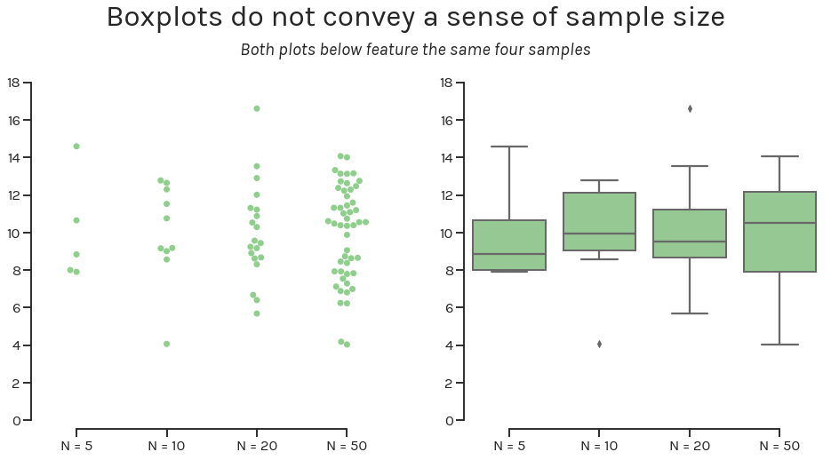
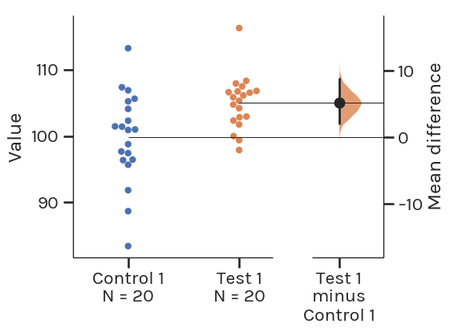
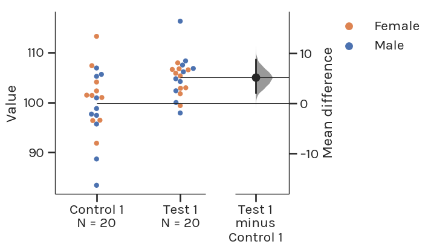
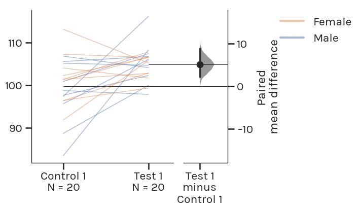
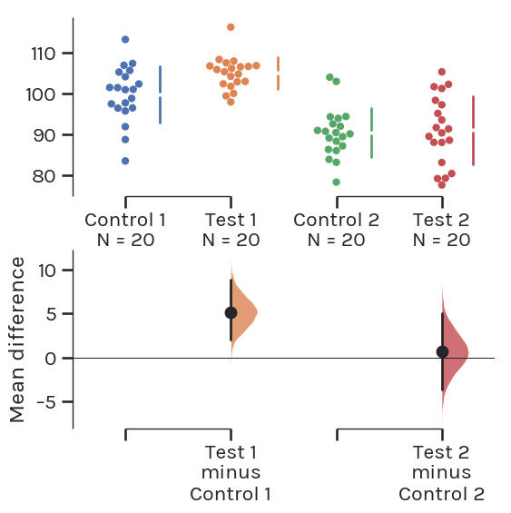
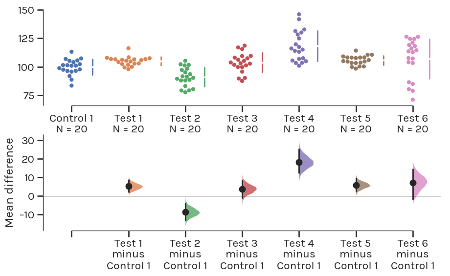

.. _Robust and Beautiful Visualization:

.. role:: raw-html(raw)
  :format: html

==============================================
Robust and Beautiful Statistical Visualization
==============================================

Current plots do not work
-------------------------

What is data visualization? Battle-Baptiste and Rusert (2018) give a
cogent and compelling definition:

    [Data visualization is] the rendering of information in a visual
    format to help communicate data while also generating new patterns
    and knowledge through the act of visualization itself. [1]_

Sadly, too many figures and visualizations in modern academic
publications seemingly fail to "generate new patterns and knowledge
through the act of visualization itself". Here, we propose a solution:
*the estimation plot*.

The barplot conceals the underlying shape
~~~~~~~~~~~~~~~~~~~~~~~~~~~~~~~~~~~~~~~~~

By only displaying the mean and standard deviation, barplots do not
accurately represent the underlying distribution of the data.

.. image:: _images/robust_5_1.png

In the above figure, four different samples with wildly different
distributions—as seen in the swarmplot on the left panel—look exactly
the same when visualized with a barplot on the right panel. (You can
download the :download:`dataset <_static/four_samples.csv>` to see for yourself.)

We're not the first ones (see
`this <https://www.nature.com/articles/nmeth.2837>`__,
`this <http://journals.plos.org/plosbiology/article?id=10.1371/journal.pbio.1002128>`__,
or
`that <https://onlinelibrary.wiley.com/doi/full/10.1111/ejn.13400>`__)
to point out the barplot's fatal flaws. Indeed, it is both sobering and
fascinating to realise that the barplot is a `17th century
invention <https://en.wikipedia.org/wiki/Bar_chart#History>`__ initially
used to compare single values, not to compare summarized and aggregated
data.

The boxplot does not convey sample size
~~~~~~~~~~~~~~~~~~~~~~~~~~~~~~~~~~~~~~~

Boxplots are another widely used visualization tool. They arguably do
include more information for each sample (medians, quartiles, maxima,
minima, and outliers), but they do not convey to the viewer the size of
each sample.

The figure above visualizes the same four samples as a swarmplot (left
panel) and as a boxplot. If we did not label the x-axis with the sample
size, it would be impossible to definitively distinguish the sample with
5 obesrvations from the sample with 50.

Even if the world gets rid of barplots and boxplots, the problems
plaguing statistical practices will remain unsolved. Null-hypothesis
significance testing—the dominant statistical paradigm in basic
research—does not indicate the **effect size**, or its **confidence
interval**.

Introducing the Estimation Plot
-------------------------------

Shown above is a Gardner-Altman estimation plot. (The plot draws its name from
`Martin J. Gardner
<https://www.independent.co.uk/news/people/obituary-professor-martin-gardner-1470261.html>`__
and `Douglas Altman <https://www.bmj.com/content/361/bmj.k2588>`__, who are
credited with `creating the design
<https://www.bmj.com/content/bmj/292/6522/746.full.pdf>`__ in 1986).

This plot has two key features:

  1. It presents all datapoints as a *swarmplot*, which orders each point to
  display the underlying distribution.

  2. It presents the effect size as a *bootstrap 95% confidence interval* (95% CI)
  on a separate but aligned axes. where the effect size is displayed to the right
  of the war data, and the mean of the test group is aligned with the effect size.

*Thus, estimation plots are robust, beautiful, and convey important statistical
information elegantly and efficiently.*

An estimation plot obtains and displays the 95% CI through nonparametric
bootstrap resampling. This enables visualization of the confidence interval as
a graded sampling distribution.

This is one important difference between estimation plots created by DABEST, and
the original Gardner-Altman design. Here, the 95% CI is computed through
parametric methods, and displayed as a vertical error bar.

Read more about this technique at :ref:`Bootstrap Confidence Intervals`.

Introducing Estimation Statistics
~~~~~~~~~~~~~~~~~~~~~~~~~~~~~~~~~

Estimation plots emerge from *estimation statistics*, a simple
`framework <https://thenewstatistics.com/itns/>`__ that avoids the
`pitfalls of significance
testing <https://www.nature.com/articles/nmeth.3288>`__. It focuses on
the effect sizes of one’s experiment/interventions, and uses familiar
statistical concepts: means, mean differences, and error bars.

Significance testing calculates the probability (the *P* value) that the
experimental data would be observed, if the intervention did not produce
a change in the metric measured (i.e. the null hypothesis). This leads
analysts to apply a false dichotomy on the experimental intervention.

Estimation statistics, on the other hand, focuses on the magnitude of
the effect (the effect size) and its precision. This encourages analysts
to gain a deeper understanding of the metrics used, and how they relate
to the natural processes being studied.

An Estimation Plot For Every Experimental Design
------------------------------------------------

For each of the most routine significance tests, there is an estimation
replacement:

Unpaired Student’s t-test → Two-group estimation plot
~~~~~~~~~~~~~~~~~~~~~~~~~~~~~~~~~~~~~~~~~~~~~~~~~~~~~

Paired Student’s t-test → Paired estimation plot
~~~~~~~~~~~~~~~~~~~~~~~~~~~~~~~~~~~~~~~~~~~~~~~~

The Gardner-Altman estimation plot can also display effect sizes for
repeated measures (aka a paired experimental design) using a `Tufte
slopegraph <http://charliepark.org/slopegraphs/>`__ instead of a
swarmplot.

One-way ANOVA + multiple comparisons → Multi two-group estimation plot
~~~~~~~~~~~~~~~~~~~~~~~~~~~~~~~~~~~~~~~~~~~~~~~~~~~~~~~~~~~~~~~~~~~~~~

For comparisons between 3 or more groups that typically employ analysis
of variance (ANOVA) methods, one can use the `Cumming estimation
plot <https://en.wikipedia.org/wiki/Estimation_statistics#Cumming_plot>`__,
named after `Geoff
Cumming <https://www.youtube.com/watch?v=nDN-hcKR7j8>`__, and draws its
design heavily from his 2012 textbook `Understanding the New
Statistics <https://www.routledge.com/Understanding-The-New-Statistics-Effect-Sizes-Confidence-Intervals-and/Cumming/p/book/9780415879682>`__.
This estimation plot design can be considered a variant of the
Gardner-Altman plot.

The effect size and 95% CIs are still plotted a separate axes, but
unlike the Gardner-Altman plot, this axes is positioned beneath the raw
data.

Such a design frees up visual space in the upper panel, allowing the
display of summary measurements (mean ± standard deviation) for each
group. These are shown as gapped lines to the right of each group. The
mean of each group is indicated as a gap in the line, adhering to Edward
Tufte’s dictum to `keep the data-ink ratio
low <https://medium.com/@plotlygraphs/maximizing-the-data-ink-ratio-in-dashboards-and-slide-deck-7887f7c1fab>`__.

Repeated measures ANOVA → Multi paired estimation plot
~~~~~~~~~~~~~~~~~~~~~~~~~~~~~~~~~~~~~~~~~~~~~~~~~~~~~~

.. image:: _images/robust_19_0.png

Ordered groups ANOVA → Shared-control estimation plot
~~~~~~~~~~~~~~~~~~~~~~~~~~~~~~~~~~~~~~~~~~~~~~~~~~~~~

Estimation Plots: The Way Forward
---------------------------------

In summary, estimation plots offer five key benefits relative to
conventional plots:

+--------------------------------------+-----------+-----------+-------------------+
|                                      | Barplot   | Boxplot   | Estimation Plot   |
+======================================+===========+===========+===================+
| Displays all observed values         | ✘         | ✘         | ✅                |
+--------------------------------------+-----------+-----------+-------------------+
| Avoids false dichotomy               | ✘         | ✘         | ✅                |
+--------------------------------------+-----------+-----------+-------------------+
| Focusses on effect size              | ✘         | ✘         | ✅                |
+--------------------------------------+-----------+-----------+-------------------+
| Visualizes effect size precision     | ✘         | ✘         | ✅                |
+--------------------------------------+-----------+-----------+-------------------+
| Shows mean difference distribution   | ✘         | ✘         | ✅                |
+--------------------------------------+-----------+-----------+-------------------+

You can create estimation plots using the DABEST (Data Analysis with
Bootstrap Estimation) packages, which are available in
`Matlab <https://github.com/ACCLAB/DABEST-Matlab>`__,
`Python <https://github.com/ACCLAB/DABEST-python>`__, and
`R <https://github.com/ACCLAB/dabestr>`__.

.. [1] `W. E. B. Du Bois’s Data Portraits: Visualizing Black America <https://www.papress.com/html/product.details.dna?isbn=9781616897062>`__. Edited by Whitney Battle-Baptiste and Britt Rusert, Princeton Architectural Press, 2018
