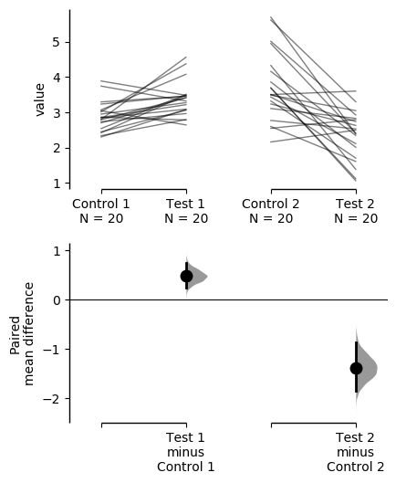

.. _Tutorial:

========
Tutorial
========

Load Libraries
--------------

.. code-block:: python3
  :linenos:

    import numpy as np
    import pandas as pd
    import dabest
    
    print("We're using DABEST v{}".format(dabest.__version__))

.. parsed-literal::

    We're using DABEST v0.3.0

Create dataset for demo
-----------------------

Here, we create a dataset to illustrate how ``dabest`` functions. In
this dataset, each column corresponds to a group of observations.

.. code-block:: python3
  :linenos:

    from scipy.stats import norm # Used in generation of populations.
    
    np.random.seed(9999) # Fix the seed so the results are replicable.
    # pop_size = 10000 # Size of each population.
    Ns = 20 # The number of samples taken from each population
    
    # Create samples
    c1 = norm.rvs(loc=3, scale=0.4, size=Ns)
    c2 = norm.rvs(loc=3.5, scale=0.75, size=Ns)
    c3 = norm.rvs(loc=3.25, scale=0.4, size=Ns)
    
    t1 = norm.rvs(loc=3.5, scale=0.5, size=Ns)
    t2 = norm.rvs(loc=2.5, scale=0.6, size=Ns)
    t3 = norm.rvs(loc=3, scale=0.75, size=Ns)
    t4 = norm.rvs(loc=3.5, scale=0.75, size=Ns)
    t5 = norm.rvs(loc=3.25, scale=0.4, size=Ns)
    t6 = norm.rvs(loc=3.25, scale=0.4, size=Ns)
    
    
    # Add a `gender` column for coloring the data.
    females = np.repeat('Female', Ns/2).tolist()
    males = np.repeat('Male', Ns/2).tolist()
    gender = females + males
    
    # Add an `id` column for paired data plotting. 
    id_col = pd.Series(range(1, Ns+1))
    
    # Combine samples and gender into a DataFrame.
    df = pd.DataFrame({'Control 1' : c1,     'Test 1' : t1,
                       'Control 2' : c2,     'Test 2' : t2,
                       'Control 3' : c3,     'Test 3' : t3,
                       'Test 4'    : t4,     'Test 5' : t5, 'Test 6' : t6,
                       'Gender'    : gender, 'ID'  : id_col
                      })

Note that we have 9 groups (3 Control samples and 6 Test samples). Our
dataset also has a non-numerical column indicating gender, and another
column indicating the identity of each observation.

This is known as a ‘wide’ dataset. See this
`writeup <https://sejdemyr.github.io/r-tutorials/basics/wide-and-long/>`__
for more details.

.. code-block:: python3
  :linenos:

    df.head()

.. raw:: html

    

    
    <table border="1" class="dataframe">
      <thead>
        <tr style="text-align: right;">
          <th></th>
          <th>Control 1</th>
          <th>Test 1</th>
          <th>Control 2</th>
          <th>Test 2</th>
          <th>Control 3</th>
          <th>Test 3</th>
          <th>Test 4</th>
          <th>Test 5</th>
          <th>Test 6</th>
          <th>Gender</th>
          <th>ID</th>
        </tr>
      </thead>
      <tbody>
        <tr>
          <th>0</th>
          <td>2.793984</td>
          <td>3.420875</td>
          <td>3.324661</td>
          <td>1.707467</td>
          <td>3.816940</td>
          <td>1.796581</td>
          <td>4.440050</td>
          <td>2.937284</td>
          <td>3.486127</td>
          <td>Female</td>
          <td>1</td>
        </tr>
        <tr>
          <th>1</th>
          <td>3.236759</td>
          <td>3.467972</td>
          <td>3.685186</td>
          <td>1.121846</td>
          <td>3.750358</td>
          <td>3.944566</td>
          <td>3.723494</td>
          <td>2.837062</td>
          <td>2.338094</td>
          <td>Female</td>
          <td>2</td>
        </tr>
        <tr>
          <th>2</th>
          <td>3.019149</td>
          <td>4.377179</td>
          <td>5.616891</td>
          <td>3.301381</td>
          <td>2.945397</td>
          <td>2.832188</td>
          <td>3.214014</td>
          <td>3.111950</td>
          <td>3.270897</td>
          <td>Female</td>
          <td>3</td>
        </tr>
        <tr>
          <th>3</th>
          <td>2.804638</td>
          <td>4.564780</td>
          <td>2.773152</td>
          <td>2.534018</td>
          <td>3.575179</td>
          <td>3.048267</td>
          <td>4.968278</td>
          <td>3.743378</td>
          <td>3.151188</td>
          <td>Female</td>
          <td>4</td>
        </tr>
        <tr>
          <th>4</th>
          <td>2.858019</td>
          <td>3.220058</td>
          <td>2.550361</td>
          <td>2.796365</td>
          <td>3.692138</td>
          <td>3.276575</td>
          <td>2.662104</td>
          <td>2.977341</td>
          <td>2.328601</td>
          <td>Female</td>
          <td>5</td>
        </tr>
      </tbody>
    </table>
    

Loading Data
------------

Before we create estimation plots and obtain confidence intervals for
our effect sizes, we need to load the data and the relevant groups.

We simply supply the DataFrame to ``dabest.load()``. We also must supply
the two groups you want to compare in the ``idx`` argument as a tuple or
list.

.. code-block:: python3
  :linenos:

    two_groups_unpaired = dabest.load(df, idx=("Control 1", "Test 1"), resamples=5000)

Calling this ``Dabest`` object gives you a gentle greeting, as well as
the comparisons that can be computed.

.. code-block:: python3
  :linenos:

    two_groups_unpaired

.. parsed-literal::

    DABEST v0.3.0
    =============
                 
    Good afternoon!
    The current time is Mon Jan 20 17:12:44 2020.
    
    Effect size(s) with 95% confidence intervals will be computed for:
    1. Test 1 minus Control 1
    
    5000 resamples will be used to generate the effect size bootstraps.

Changing statistical parameters
~~~~~~~~~~~~~~~~~~~~~~~~~~~~~~~

If the dataset contains paired data (ie. repeated observations), specify
this with the ``paired`` keyword. You must also pass a column in the
dataset that indicates the identity of each observation, using the
``id_col`` keyword.

.. code-block:: python3
  :linenos:

    two_groups_paired = dabest.load(df, idx=("Control 1", "Test 1"), 
                                  paired=True, id_col="ID")

.. code-block:: python3
  :linenos:

    two_groups_paired

.. parsed-literal::

    DABEST v0.3.0
    =============
                 
    Good afternoon!
    The current time is Mon Jan 20 17:12:44 2020.
    
    Paired effect size(s) with 95% confidence intervals will be computed for:
    1. Test 1 minus Control 1
    
    5000 resamples will be used to generate the effect size bootstraps.

You can also change the width of the confidence interval that will be
produced.

.. code-block:: python3
  :linenos:

    two_groups_unpaired_ci90 = dabest.load(df, idx=("Control 1", "Test 1"), ci=90)

.. code-block:: python3
  :linenos:

    two_groups_unpaired_ci90

.. parsed-literal::

    DABEST v0.3.0
    =============
                 
    Good afternoon!
    The current time is Mon Jan 20 17:12:44 2020.
    
    Effect size(s) with 90% confidence intervals will be computed for:
    1. Test 1 minus Control 1
    
    5000 resamples will be used to generate the effect size bootstraps.

Effect sizes
------------

``dabest`` now features a range of effect sizes: 
  - the mean difference (``mean_diff``) 
  - the median difference (``median_diff``) 
  - `Cohen’s d <https://en.wikipedia.org/wiki/Effect_size#Cohen's_d>`__ (``cohens_d``) 
  - `Hedges’ g <https://en.wikipedia.org/wiki/Effect_size#Hedges'_g>`__ (``hedges_g``) 
  - `Cliff’s delta <https://en.wikipedia.org/wiki/Effect_size#Effect_size_for_ordinal_data>`__ (``cliffs_delta``)

Each of these are attributes of the ``Dabest`` object.

.. code-block:: python3
  :linenos:

    two_groups_unpaired.mean_diff

.. parsed-literal::

    DABEST v0.3.0
    =============
                 
    Good afternoon!
    The current time is Mon Jan 20 17:12:44 2020.
    
    The unpaired mean difference between Control 1 and Test 1 is 0.48 [95%CI 0.221, 0.768].
    The p-value of the two-sided permutation t-test is 0.001. 
    
    5000 bootstrap samples were taken; the confidence interval is bias-corrected and accelerated.
    The p-value(s) reported are the likelihood(s) of observing the effect size(s),
    if the null hypothesis of zero difference is true.
    For each p-value, 5000 reshuffles of the control and test labels were performed.
    
    To get the results of all valid statistical tests, use `.mean_diff.statistical_tests`

For each comparison, the type of effect size is reported (here, it’s the
“unpaired mean difference”). The confidence interval is reported as:
[*confidenceIntervalWidth* *LowerBound*, *UpperBound*]

This confidence interval is generated through bootstrap resampling. See
:doc:`bootstraps` for more details.

Since v0.3.0, DABEST will report the p-value of the `non-parametric two-sided approximate permutation t-test <https://en.wikipedia.org/wiki/Resampling_(statistics)#Permutation_tests>`__. This is also known as the Monte Carlo permutation test. 

For unpaired comparisons, the p-values and test statistics of `Welch's t test <https://en.wikipedia.org/wiki/Welch%27s_t-test>`__, `Student's t test <https://en.wikipedia.org/wiki/Student%27s_t-test>`__, and `Mann-Whitney U test <https://en.wikipedia.org/wiki/Mann%E2%80%93Whitney_U_test>`__ can be found in addition. For paired comparisons, the p-values and test statistics of the `paired Student's t <https://en.wikipedia.org/wiki/Student%27s_t-test#Paired_samples>`__ and `Wilcoxon <https://en.wikipedia.org/wiki/Wilcoxon_signed-rank_test>`__ tests are presented.

.. code-block:: python3
  :linenos:

    pd.options.display.max_columns = 50
    two_groups_unpaired.mean_diff.results

.. raw:: html

    

    
    <table border="1" class="dataframe">
      <thead>
        <tr style="text-align: right;">
          <th></th>
          <th>control</th>
          <th>test</th>
          <th>control_N</th>
          <th>test_N</th>
          <th>effect_size</th>
          <th>is_paired</th>
          <th>difference</th>
          <th>ci</th>
          <th>bca_low</th>
          <th>bca_high</th>
          <th>bca_interval_idx</th>
          <th>pct_low</th>
          <th>pct_high</th>
          <th>pct_interval_idx</th>
          <th>pvalue_permutation</th>
          <th>permutation_count</th>
          <th>bootstraps</th>
          <th>resamples</th>
          <th>random_seed</th>
          <th>pvalue_welch</th>
          <th>statistic_welch</th>
          <th>pvalue_students_t</th>
          <th>statistic_students_t</th>
          <th>pvalue_mann_whitney</th>
          <th>statistic_mann_whitney</th>
        </tr>
      </thead>
      <tbody>
        <tr>
          <th>0</th>
          <td>Control 1</td>
          <td>Test 1</td>
          <td>20</td>
          <td>20</td>
          <td>mean difference</td>
          <td>False</td>
          <td>0.48029</td>
          <td>95</td>
          <td>0.220869</td>
          <td>0.767721</td>
          <td>(140, 4889)</td>
          <td>0.215697</td>
          <td>0.761716</td>
          <td>(125, 4875)</td>
          <td>0.001</td>
          <td>5000</td>
          <td>[-0.157303571150468, -0.025932185794146356, 0....</td>
          <td>5000</td>
          <td>12345</td>
          <td>0.002094</td>
          <td>-3.308806</td>
          <td>0.002057</td>
          <td>-3.308806</td>
          <td>0.001625</td>
          <td>83.0</td>
        </tr>
      </tbody>
    </table>
    

.. code-block:: python3
  :linenos:

    two_groups_unpaired.mean_diff.statistical_tests

.. raw:: html

    

    
    <table border="1" class="dataframe">
      <thead>
        <tr style="text-align: right;">
          <th></th>
          <th>control</th>
          <th>test</th>
          <th>control_N</th>
          <th>test_N</th>
          <th>effect_size</th>
          <th>is_paired</th>
          <th>difference</th>
          <th>ci</th>
          <th>bca_low</th>
          <th>bca_high</th>
          <th>pvalue_permutation</th>
          <th>pvalue_welch</th>
          <th>statistic_welch</th>
          <th>pvalue_students_t</th>
          <th>statistic_students_t</th>
          <th>pvalue_mann_whitney</th>
          <th>statistic_mann_whitney</th>
        </tr>
      </thead>
      <tbody>
        <tr>
          <th>0</th>
          <td>Control 1</td>
          <td>Test 1</td>
          <td>20</td>
          <td>20</td>
          <td>mean difference</td>
          <td>False</td>
          <td>0.48029</td>
          <td>95</td>
          <td>0.220869</td>
          <td>0.767721</td>
          <td>0.001</td>
          <td>0.002094</td>
          <td>-3.308806</td>
          <td>0.002057</td>
          <td>-3.308806</td>
          <td>0.001625</td>
          <td>83.0</td>
        </tr>
      </tbody>
    </table>
    

Let’s compute the Hedges’ *g* for our comparison.

.. code-block:: python3
  :linenos:

    two_groups_unpaired.hedges_g

.. parsed-literal::

    DABEST v0.3.0
    =============
                 
    Good afternoon!
    The current time is Mon Jan 20 17:12:46 2020.
    
    The unpaired Hedges' g between Control 1 and Test 1 is 1.03 [95%CI 0.349, 1.62].
    The p-value of the two-sided permutation t-test is 0.001. 
    
    5000 bootstrap samples were taken; the confidence interval is bias-corrected and accelerated.
    The p-value(s) reported are the likelihood(s) of observing the effect size(s),
    if the null hypothesis of zero difference is true.
    For each p-value, 5000 reshuffles of the control and test labels were performed.
    
    To get the results of all valid statistical tests, use `.hedges_g.statistical_tests`

.. code-block:: python3
  :linenos:

    two_groups_unpaired.hedges_g.results

.. raw:: html

    

    
    <table border="1" class="dataframe">
      <thead>
        <tr style="text-align: right;">
          <th></th>
          <th>control</th>
          <th>test</th>
          <th>control_N</th>
          <th>test_N</th>
          <th>effect_size</th>
          <th>is_paired</th>
          <th>difference</th>
          <th>ci</th>
          <th>bca_low</th>
          <th>bca_high</th>
          <th>bca_interval_idx</th>
          <th>pct_low</th>
          <th>pct_high</th>
          <th>pct_interval_idx</th>
          <th>pvalue_permutation</th>
          <th>permutation_count</th>
          <th>bootstraps</th>
          <th>resamples</th>
          <th>random_seed</th>
          <th>pvalue_welch</th>
          <th>statistic_welch</th>
          <th>pvalue_students_t</th>
          <th>statistic_students_t</th>
          <th>pvalue_mann_whitney</th>
          <th>statistic_mann_whitney</th>
        </tr>
      </thead>
      <tbody>
        <tr>
          <th>0</th>
          <td>Control 1</td>
          <td>Test 1</td>
          <td>20</td>
          <td>20</td>
          <td>Hedges' g</td>
          <td>False</td>
          <td>1.025525</td>
          <td>95</td>
          <td>0.349394</td>
          <td>1.618579</td>
          <td>(42, 4724)</td>
          <td>0.472844</td>
          <td>1.74166</td>
          <td>(125, 4875)</td>
          <td>0.001</td>
          <td>5000</td>
          <td>[-0.3617512915188043, -0.06120428036887727, 0....</td>
          <td>5000</td>
          <td>12345</td>
          <td>0.002094</td>
          <td>-3.308806</td>
          <td>0.002057</td>
          <td>-3.308806</td>
          <td>0.001625</td>
          <td>83.0</td>
        </tr>
      </tbody>
    </table>
    

Producing estimation plots
--------------------------

To produce a **Gardner-Altman estimation plot**, simply use the
``.plot()`` method. You can read more about its genesis and design
inspiration at :doc:`robust-beautiful`.

Every effect size instance has access to the ``.plot()`` method. This
means you can quickly create plots for different effect sizes easily.

.. code-block:: python3
  :linenos:
  
  
  two_groups_unpaired.mean_diff.plot();

.. image:: _images/tutorial_27_0.png

.. code-block:: python3
  :linenos:

    two_groups_unpaired.hedges_g.plot();

.. image:: _images/tutorial_28_0.png

Instead of a Gardner-Altman plot, you can produce a **Cumming estimation
plot** by setting ``float_contrast=False`` in the ``plot()`` method.
This will plot the bootstrap effect sizes below the raw data, and also
displays the the mean (gap) and ± standard deviation of each group
(vertical ends) as gapped lines. This design was inspired by Edward
Tufte’s dictum to maximise the data-ink ratio.

.. code-block:: python3
  :linenos:

    two_groups_unpaired.hedges_g.plot(float_contrast=False);

.. image:: _images/tutorial_30_0.png

For paired data, we use
`slopegraphs <https://www.edwardtufte.com/bboard/q-and-a-fetch-msg?msg_id=0003nk>`__
(another innovation from Edward Tufte) to connect paired observations.
Both Gardner-Altman and Cumming plots support this.

.. code-block:: python3
  :linenos:

    two_groups_paired.mean_diff.plot();

.. image:: _images/tutorial_32_0.png

.. code-block:: python3
  :linenos:

    two_groups_paired.mean_diff.plot(float_contrast=False);

.. image:: _images/tutorial_33_0.png

The ``dabest`` package also implements a range of estimation plot
designs aimed at depicting common experimental designs.

The **multi-two-group estimation plot** tiles two or more Cumming plots
horizontally, and is created by passing a *nested tuple* to ``idx`` when
``dabest.load()`` is first invoked.

Thus, the lower axes in the Cumming plot is effectively a `forest
plot <https://en.wikipedia.org/wiki/Forest_plot>`__, used in
meta-analyses to aggregate and compare data from different experiments.

.. code-block:: python3
  :linenos:

    multi_2group = dabest.load(df, idx=(("Control 1", "Test 1",),
                                         ("Control 2", "Test 2")
                                       ))
    
    multi_2group.mean_diff.plot();

.. image:: _images/tutorial_35_0.png

The multi-two-group design also accomodates paired comparisons.

.. code-block:: python3
  :linenos:

    multi_2group_paired = dabest.load(df, idx=(("Control 1", "Test 1"),
                                               ("Control 2", "Test 2")
                                              ),
                                      paired=True, id_col="ID"
                                     )
    
    multi_2group_paired.mean_diff.plot();

The **shared control plot** displays another common experimental
paradigm, where several test samples are compared against a common
reference sample.

This type of Cumming plot is automatically generated if the tuple passed
to ``idx`` has more than two data columns.

.. code-block:: python3
  :linenos:

    shared_control = dabest.load(df, idx=("Control 1", "Test 1",
                                          "Test 2", "Test 3",
                                          "Test 4", "Test 5", "Test 6")
                                 )

.. code-block:: python3
  :linenos:

    shared_control

.. parsed-literal::

    DABEST v0.3.0
    =============
                 
    Good afternoon!
    The current time is Mon Jan 20 17:12:54 2020.
    
    Effect size(s) with 95% confidence intervals will be computed for:
    1. Test 1 minus Control 1
    2. Test 2 minus Control 1
    3. Test 3 minus Control 1
    4. Test 4 minus Control 1
    5. Test 5 minus Control 1
    6. Test 6 minus Control 1
    
    5000 resamples will be used to generate the effect size bootstraps.

.. code-block:: python3
  :linenos:

    shared_control.mean_diff

.. parsed-literal::

    DABEST v0.3.0
    =============
                 
    Good afternoon!
    The current time is Mon Jan 20 17:12:58 2020.
    
    The unpaired mean difference between Control 1 and Test 1 is 0.48 [95%CI 0.221, 0.768].
    The p-value of the two-sided permutation t-test is 0.001. 
    
    The unpaired mean difference between Control 1 and Test 2 is -0.542 [95%CI -0.914, -0.211].
    The p-value of the two-sided permutation t-test is 0.0042. 
    
    The unpaired mean difference between Control 1 and Test 3 is 0.174 [95%CI -0.295, 0.628].
    The p-value of the two-sided permutation t-test is 0.479. 
    
    The unpaired mean difference between Control 1 and Test 4 is 0.79 [95%CI 0.306, 1.31].
    The p-value of the two-sided permutation t-test is 0.0042. 
    
    The unpaired mean difference between Control 1 and Test 5 is 0.265 [95%CI 0.0137, 0.497].
    The p-value of the two-sided permutation t-test is 0.0404. 
    
    The unpaired mean difference between Control 1 and Test 6 is 0.288 [95%CI -0.00441, 0.515].
    The p-value of the two-sided permutation t-test is 0.0324. 
    
    5000 bootstrap samples were taken; the confidence interval is bias-corrected and accelerated.
    The p-value(s) reported are the likelihood(s) of observing the effect size(s),
    if the null hypothesis of zero difference is true.
    For each p-value, 5000 reshuffles of the control and test labels were performed.
    
    To get the results of all valid statistical tests, use `.mean_diff.statistical_tests`

.. code-block:: python3
  :linenos:

    shared_control.mean_diff.plot();

.. image:: _images/tutorial_42_0.png

``dabest`` thus empowers you to robustly perform and elegantly present
complex visualizations and statistics.

.. code-block:: python3
  :linenos:

    multi_groups = dabest.load(df, idx=(("Control 1", "Test 1",),
                                         ("Control 2", "Test 2","Test 3"),
                                         ("Control 3", "Test 4","Test 5", "Test 6")
                                       ))

.. code-block:: python3
  :linenos:

    multi_groups

.. parsed-literal::

    DABEST v0.3.0
    =============
                 
    Good afternoon!
    The current time is Mon Jan 20 17:12:58 2020.
    
    Effect size(s) with 95% confidence intervals will be computed for:
    1. Test 1 minus Control 1
    2. Test 2 minus Control 2
    3. Test 3 minus Control 2
    4. Test 4 minus Control 3
    5. Test 5 minus Control 3
    6. Test 6 minus Control 3
    
    5000 resamples will be used to generate the effect size bootstraps.

.. code-block:: python3
  :linenos:

    multi_groups.mean_diff

.. parsed-literal::

    DABEST v0.3.0
    =============
                 
    Good afternoon!
    The current time is Mon Jan 20 17:13:02 2020.
    
    The unpaired mean difference between Control 1 and Test 1 is 0.48 [95%CI 0.221, 0.768].
    The p-value of the two-sided permutation t-test is 0.001. 
    
    The unpaired mean difference between Control 2 and Test 2 is -1.38 [95%CI -1.93, -0.895].
    The p-value of the two-sided permutation t-test is 0.0. 
    
    The unpaired mean difference between Control 2 and Test 3 is -0.666 [95%CI -1.3, -0.103].
    The p-value of the two-sided permutation t-test is 0.0352. 
    
    The unpaired mean difference between Control 3 and Test 4 is 0.362 [95%CI -0.114, 0.887].
    The p-value of the two-sided permutation t-test is 0.161. 
    
    The unpaired mean difference between Control 3 and Test 5 is -0.164 [95%CI -0.404, 0.0742].
    The p-value of the two-sided permutation t-test is 0.208. 
    
    The unpaired mean difference between Control 3 and Test 6 is -0.14 [95%CI -0.398, 0.102].
    The p-value of the two-sided permutation t-test is 0.282. 
    
    5000 bootstrap samples were taken; the confidence interval is bias-corrected and accelerated.
    The p-value(s) reported are the likelihood(s) of observing the effect size(s),
    if the null hypothesis of zero difference is true.
    For each p-value, 5000 reshuffles of the control and test labels were performed.
    
    To get the results of all valid statistical tests, use `.mean_diff.statistical_tests`

.. code-block:: python3
  :linenos:

    multi_groups.mean_diff.plot();

.. image:: _images/tutorial_47_0.png

Using long (aka ‘melted’) data frames
~~~~~~~~~~~~~~~~~~~~~~~~~~~~~~~~~~~~~

``dabest`` can also work with ‘melted’ or ‘long’ data. This term is so
used because each row will now correspond to a single datapoint, with
one column carrying the value and other columns carrying ‘metadata’
describing that datapoint.

More details on wide vs long or ‘melted’ data can be found in this
`Wikipedia
article <https://en.wikipedia.org/wiki/Wide_and_narrow_data>`__. The
`pandas
documentation <https://pandas.pydata.org/pandas-docs/stable/generated/pandas.melt.html>`__
gives recipes for melting dataframes.

.. code-block:: python3
  :linenos:

    x='group'
    y='metric'
    
    value_cols = df.columns[:-2] # select all but the "Gender" and "ID" columns.
    
    df_melted = pd.melt(df.reset_index(),
                        id_vars=["Gender", "ID"],
                        value_vars=value_cols,
                        value_name=y,
                        var_name=x)
    
    df_melted.head() # Gives the first five rows of `df_melted`.

.. raw:: html

    

    
    <table border="1" class="dataframe">
      <thead>
        <tr style="text-align: right;">
          <th></th>
          <th>Gender</th>
          <th>ID</th>
          <th>group</th>
          <th>metric</th>
        </tr>
      </thead>
      <tbody>
        <tr>
          <th>0</th>
          <td>Female</td>
          <td>1</td>
          <td>Control 1</td>
          <td>2.793984</td>
        </tr>
        <tr>
          <th>1</th>
          <td>Female</td>
          <td>2</td>
          <td>Control 1</td>
          <td>3.236759</td>
        </tr>
        <tr>
          <th>2</th>
          <td>Female</td>
          <td>3</td>
          <td>Control 1</td>
          <td>3.019149</td>
        </tr>
        <tr>
          <th>3</th>
          <td>Female</td>
          <td>4</td>
          <td>Control 1</td>
          <td>2.804638</td>
        </tr>
        <tr>
          <th>4</th>
          <td>Female</td>
          <td>5</td>
          <td>Control 1</td>
          <td>2.858019</td>
        </tr>
      </tbody>
    </table>
    

When your data is in this format, you will need to specify the ``x`` and
``y`` columns in ``dabest.load()``.

.. code-block:: python3
  :linenos:

    analysis_of_long_df = dabest.load(df_melted, idx=("Control 1", "Test 1"),
                                     x="group", y="metric")
    
    analysis_of_long_df

.. parsed-literal::

    DABEST v0.3.0
    =============
                 
    Good afternoon!
    The current time is Mon Jan 20 17:13:03 2020.
    
    Effect size(s) with 95% confidence intervals will be computed for:
    1. Test 1 minus Control 1
    
    5000 resamples will be used to generate the effect size bootstraps.

.. code-block:: python3
  :linenos:

    analysis_of_long_df.mean_diff.plot();

.. image:: _images/tutorial_52_0.png

Controlling plot aesthetics
~~~~~~~~~~~~~~~~~~~~~~~~~~~

Changing the y-axes labels.

.. code-block:: python3
  :linenos:

    two_groups_unpaired.mean_diff.plot(swarm_label="This is my\nrawdata",  
                                       contrast_label="The bootstrap\ndistribtions!");

.. image:: _images/tutorial_55_0.png

Color the rawdata according to another column in the dataframe.

.. code-block:: python3
  :linenos:

    multi_2group.mean_diff.plot(color_col="Gender");

.. image:: _images/tutorial_57_0.png

.. code-block:: python3
  :linenos:

    two_groups_paired.mean_diff.plot(color_col="Gender");

.. image:: _images/tutorial_58_0.png

Changing the palette used with ``custom_palette``. Any valid matplotlib
or seaborn color palette is accepted.

.. code-block:: python3
  :linenos:

    multi_2group.mean_diff.plot(color_col="Gender", custom_palette="Dark2");

.. image:: _images/tutorial_60_0.png

.. code-block:: python3
  :linenos:

    multi_2group.mean_diff.plot(custom_palette="Paired");

.. image:: _images/tutorial_61_0.png

You can also create your own color palette. Create a dictionary where
the keys are group names, and the values are valid matplotlib colors.

You can specify matplotlib colors in a `variety of
ways <https://matplotlib.org/users/colors.html>`__. Here, I demonstrate
using named colors, hex strings (commonly used on the web), and RGB
tuples.

.. code-block:: python3
  :linenos:

    my_color_palette = {"Control 1" : "blue",    
                        "Test 1"    : "purple",
                        "Control 2" : "#cb4b16",     # This is a hex string.
                        "Test 2"    : (0., 0.7, 0.2) # This is a RGB tuple.
                       }
    
    multi_2group.mean_diff.plot(custom_palette=my_color_palette);

.. image:: _images/tutorial_63_0.png

By default, ``dabest.plot()`` will
`desaturate <https://en.wikipedia.org/wiki/Colorfulness#Saturation>`__
the color of the dots in the swarmplot by 50%. This draws attention to
the effect size bootstrap curves.

You can alter the default values with the ``swarm_desat`` and
``halfviolin_desat`` keywords.

.. code-block:: python3
  :linenos:

    multi_2group.mean_diff.plot(custom_palette=my_color_palette, 
                                swarm_desat=0.75, 
                                halfviolin_desat=0.25);

.. image:: _images/tutorial_65_0.png

You can also change the sizes of the dots used in the rawdata swarmplot,
and those used to indicate the effect sizes.

.. code-block:: python3
  :linenos:

    multi_2group.mean_diff.plot(raw_marker_size=3, 
                                es_marker_size=12);

.. image:: _images/tutorial_67_0.png

Changing the y-limits for the rawdata axes, and for the contrast axes.

.. code-block:: python3
  :linenos:

    multi_2group.mean_diff.plot(swarm_ylim=(0, 5), 
                                contrast_ylim=(-2, 2));

.. image:: _images/tutorial_69_0.png

If your effect size is qualitatively inverted (ie. a smaller value is a
better outcome), you can simply invert the tuple passed to
``contrast_ylim``.

.. code-block:: python3
  :linenos:

    multi_2group.mean_diff.plot(contrast_ylim=(2, -2), 
                                contrast_label="More negative is better!");

.. image:: _images/tutorial_71_0.png

You can add minor ticks and also change the tick frequency by accessing
the axes directly.

Each estimation plot produced by ``dabest`` has 2 axes. The first one
contains the rawdata swarmplot; the second one contains the bootstrap
effect size differences.

.. code-block:: python3
  :linenos:

    import matplotlib.ticker as Ticker
    
    f = two_groups_unpaired.mean_diff.plot()
    
    rawswarm_axes = f.axes[0]
    contrast_axes = f.axes[1]
    
    rawswarm_axes.yaxis.set_major_locator(Ticker.MultipleLocator(1))
    rawswarm_axes.yaxis.set_minor_locator(Ticker.MultipleLocator(0.5))
    
    contrast_axes.yaxis.set_major_locator(Ticker.MultipleLocator(0.5))
    contrast_axes.yaxis.set_minor_locator(Ticker.MultipleLocator(0.25))

.. image:: _images/tutorial_73_0.png

.. code-block:: python3
  :linenos:

    f = multi_2group.mean_diff.plot(swarm_ylim=(0,6),
                                   contrast_ylim=(-3, 1))
    
    rawswarm_axes = f.axes[0]
    contrast_axes = f.axes[1]
    
    rawswarm_axes.yaxis.set_major_locator(Ticker.MultipleLocator(2))
    rawswarm_axes.yaxis.set_minor_locator(Ticker.MultipleLocator(1))
    
    contrast_axes.yaxis.set_major_locator(Ticker.MultipleLocator(0.5))
    contrast_axes.yaxis.set_minor_locator(Ticker.MultipleLocator(0.25))

.. image:: _images/tutorial_74_0.png

.. _inset plot:

Creating estimation plots in existing axes
~~~~~~~~~~~~~~~~~~~~~~~~~~~~~~~~~~~~~~~~~~

*Implemented in v0.2.6 by Adam Nekimken*.

``dabest.plot`` has an ``ax`` keyword that accepts any Matplotlib
``Axes``. The entire estimation plot will be created in the specified
``Axes``.

.. code-block:: python3
  :linenos:

    from matplotlib import pyplot as plt
    f, axx = plt.subplots(nrows=2, ncols=2, 
                          figsize=(15, 15),
                          gridspec_kw={'wspace': 0.25} # ensure proper width-wise spacing.
                         )
    
    two_groups_unpaired.mean_diff.plot(ax=axx.flat[0]);
    
    two_groups_paired.mean_diff.plot(ax=axx.flat[1]);
    
    multi_2group.mean_diff.plot(ax=axx.flat[2]);
    
    multi_2group_paired.mean_diff.plot(ax=axx.flat[3]);

.. image:: _images/tutorial_76_0.png

In this case, to access the individual rawdata axes, use
``name_of_axes`` to manipulate the rawdata swarmplot axes, and
``name_of_axes.contrast_axes`` to gain access to the effect size axes.

.. code-block:: python3
  :linenos:

    topleft_axes = axx.flat[0]
    topleft_axes.set_ylabel("New y-axis label for rawdata")
    topleft_axes.contrast_axes.set_ylabel("New y-axis label for effect size")
    
    f

.. image:: _images/tutorial_78_0.png

Applying style sheets
~~~~~~~~~~~~~~~~~~~~~

*Implemented in v0.2.0*.

``dabest`` can now apply `matplotlib style
sheets <https://matplotlib.org/tutorials/introductory/customizing.html>`__
to estimation plots. You can refer to this
`gallery <https://matplotlib.org/3.0.3/gallery/style_sheets/style_sheets_reference.html>`__
of style sheets for reference.

.. code-block:: python3
  :linenos:

    import matplotlib.pyplot as plt
    plt.style.use("dark_background")

.. code-block:: python3
  :linenos:

    multi_2group.mean_diff.plot();

.. image:: _images/tutorial_81_0.png

