.. _Tutorial:
.. highlight:: python
  :linenothreshold: 2
  :dedent: 4

========
Tutorial
========

Load libraries
==============

.. code-block:: ipython3
   :linenos:

    import os

    import numpy as np
    import pandas as pd

    import dabest
    %matplotlib inline

    print("We're using DABEST v{}".format(dabest.__version__))

.. parsed-literal::

    We're using DABEST v0.1.5

Create dummy dataset
====================

Here, we create a dummy dataset to illustrate how ``dabest`` functions.
In this dataset, each column corresponds to a group of observations, and
each row is simply an index number referring to an observation.

This is known as a 'wide' dataset. See this
`writeup <https://sejdemyr.github.io/r-tutorials/basics/wide-and-long/>`__
for more details.

.. code-block:: ipython3
   :linenos:

    from scipy.stats import norm # Used in generation of populations.

    np.random.seed(9999) # Fix the seed so the results are replicable.
    pop_size = 10000 # Size of each population.
    Ns = 20 # The number of samples taken from each population

    # Create populations
    control_pop = norm.rvs(loc=3, scale=0.4, size=pop_size)
    pop1 = norm.rvs(loc=3.5, scale=0.5, size=pop_size)
    pop2 = norm.rvs(loc=2.5, scale=0.6, size=pop_size)
    pop3 = norm.rvs(loc=3, scale=0.75, size=pop_size)
    pop4 = norm.rvs(loc=3.5, scale=0.75, size=pop_size)
    pop5 = norm.rvs(loc=3.25, scale=0.4, size=pop_size)

    # Sample from the populations
    choice_kwargs = dict(size=Ns, replace=False)

    control = np.random.choice(control_pop, **choice_kwargs)
    g1 = np.random.choice(pop1, **choice_kwargs)
    g2 = np.random.choice(pop2, **choice_kwargs)
    g3 = np.random.choice(pop3, **choice_kwargs)
    g4 = np.random.choice(pop4, **choice_kwargs)
    g5 = np.random.choice(pop5, **choice_kwargs)

    # Add a `gender` column for coloring the data.
    females = np.repeat('Female', Ns/2).tolist()
    males = np.repeat('Male', Ns/2).tolist()
    gender = females + males

    # Combine samples and gender into a DataFrame.
    df = pd.DataFrame({'Control': control,
                       'Group 1': g1,
                       'Group 2': g2,
                       'Group 3': g3,
                       'Group 4': g4,
                       'Group 5': g5,
                       'Gender' : gender,
                      })

Note that we have 6 groups of observations, with an additional
non-numerical column indicating gender.

Independent two-group estimation plot
=====================================

The simplest estimation plot can be generated with ``dabest.plot()``.
Supply the DataFrame; supply the two groups you want to compare in the
``idx`` argument as a tuple or list.

.. code-block:: ipython3
   :linenos:

    fig1, results1 = dabest.plot(df, idx=('Control','Group 1'))

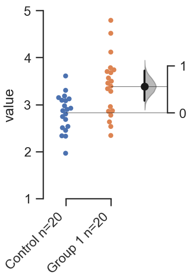

The ``dabest.plot()`` function will return 2 objects: a matplotlib
``Figure`` and a pandas ``DataFrame``.

In the Jupyter Notebook, with ``%matplotlib inline``, the figure should
automatically appear.

``dabest.plot()`` will automatically drop any NaNs in the data. Note how
the Ns (appended to the group names in the xtick labels) indicate the
number of datapoints being plotted, and used to calculate the contrasts.

The pandas ``DataFrame`` returned by ``dabest.plot()`` contains the
statistics computed in the course of generating the plot, with
confidence intervals (95% by default) and relevant *P* values.

.. code-block:: ipython3
   :linenos:

    results1 # prints out the DataFrame returned by `dabest.plot()`.

.. raw:: html

    

    
    <table border="0" class="dataframe">
      <thead>
        <tr style="text-align: right;">
          <th></th>
          <th>reference_group</th>
          <th>experimental_group</th>
          <th>stat_summary</th>
          <th>bca_ci_low</th>
          <th>bca_ci_high</th>
          <th>ci</th>
          <th>is_difference</th>
          <th>is_paired</th>
          <th>pvalue_2samp_ind_ttest</th>
          <th>pvalue_mann_whitney</th>
        </tr>
      </thead>
      <tbody>
        <tr>
          <th>0</th>
          <td>Control</td>
          <td>Group 1</td>
          <td>0.564092</td>
          <td>0.253715</td>
          <td>0.890816</td>
          <td>95.0</td>
          <td>True</td>
          <td>False</td>
          <td>0.001811</td>
          <td>0.004703</td>
        </tr>
      </tbody>
    </table>
    

You can color the dots with any column in the DataFrame, using the
``color_col`` keyword.

.. code-block:: ipython3
   :linenos:

    f2, results2 = dabest.plot(df, idx=('Control','Group 1'),
                               color_col='Gender')

Paired two-group estimation plot
================================

DABEST can also produce estimation plots for paired observations
(repeated measures). This is done by setting the ``paired`` option to
``True``.

The estimation plot uses lines to indicate the pairs of observations.
The combined visual effect of the slopes of these lines serves to give
the viewer an intuitive sense of the effect size between the two groups
of repeated observations.

.. code-block:: ipython3
   :linenos:

    f3, results3 = dabest.plot(df, idx=('Control','Group 1'),
                               color_col='Gender',
                               paired=True)

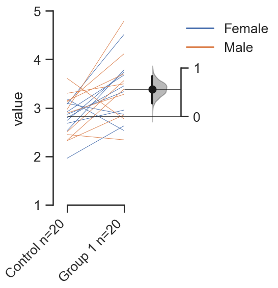

If you want to plot the raw swarmplot instead of the paired lines, use
the ``show_pairs`` flag to set this. The contrasts computed will still
be paired, as indicated by the DataFrame produced.

.. code-block:: ipython3
   :linenos:

    f4, results4 = dabest.plot(df, idx=('Control','Group 1'),
                               color_col='Gender',
                               paired=True,
                               show_pairs=False)
    results4

.. raw:: html

    

    <table border="0" class="dataframe">
      <thead>
        <tr style="text-align: right;">
          <th></th>
          <th>reference_group</th>
          <th>experimental_group</th>
          <th>stat_summary</th>
          <th>bca_ci_low</th>
          <th>bca_ci_high</th>
          <th>ci</th>
          <th>is_difference</th>
          <th>is_paired</th>
          <th>pvalue_2samp_paired_ttest</th>
          <th>pvalue_wilcoxon</th>
        </tr>
      </thead>
      <tbody>
        <tr>
          <th>0</th>
          <td>Control</td>
          <td>Group 1</td>
          <td>0.564092</td>
          <td>0.26027</td>
          <td>0.826475</td>
          <td>95.0</td>
          <td>True</td>
          <td>True</td>
          <td>0.001285</td>
          <td>0.003185</td>
        </tr>
      </tbody>
    </table>
    

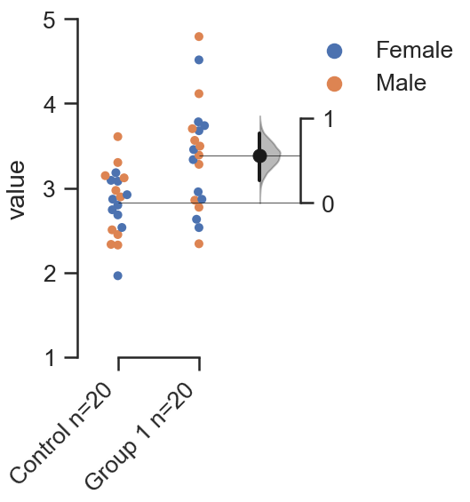

Multi two-group estimation plot
===============================

In a multi-group design, you can horizontally tile two or more two-group
floating-contrasts. This is designed to meet data visualization and
presentation paradigms that are predominant in academic biomedical
research, where several two-group experiments are presented together.

This is done mainly through the ``idx`` option. You can nest two or more
tuples or lists within a single tuple/list to create a seperate subplot
for that contrast.

The effect sizes and confidence intervals for each two-group plot will
be computed.

.. code-block:: ipython3
   :linenos:

    f5, results5 = dabest.plot(df, idx=(('Control','Group 1'),
                                        ('Group 2','Group 3'),
                                        ('Group 4','Group 5'))
                              )

    results5

.. raw:: html

    

    <table border="0" class="dataframe">
      <thead>
        <tr style="text-align: right;">
          <th></th>
          <th>reference_group</th>
          <th>experimental_group</th>
          <th>stat_summary</th>
          <th>bca_ci_low</th>
          <th>bca_ci_high</th>
          <th>ci</th>
          <th>is_difference</th>
          <th>is_paired</th>
          <th>pvalue_2samp_ind_ttest</th>
          <th>pvalue_mann_whitney</th>
        </tr>
      </thead>
      <tbody>
        <tr>
          <th>0</th>
          <td>Control</td>
          <td>Group 1</td>
          <td>0.564092</td>
          <td>0.243696</td>
          <td>0.889834</td>
          <td>95.0</td>
          <td>True</td>
          <td>False</td>
          <td>0.001811</td>
          <td>0.004703</td>
        </tr>
        <tr>
          <th>1</th>
          <td>Group 2</td>
          <td>Group 3</td>
          <td>0.253319</td>
          <td>-0.116257</td>
          <td>0.600037</td>
          <td>95.0</td>
          <td>True</td>
          <td>False</td>
          <td>0.190823</td>
          <td>0.155570</td>
        </tr>
        <tr>
          <th>2</th>
          <td>Group 4</td>
          <td>Group 5</td>
          <td>-0.278511</td>
          <td>-0.543416</td>
          <td>0.021980</td>
          <td>95.0</td>
          <td>True</td>
          <td>False</td>
          <td>0.070806</td>
          <td>0.041124</td>
        </tr>
      </tbody>
    </table>
    

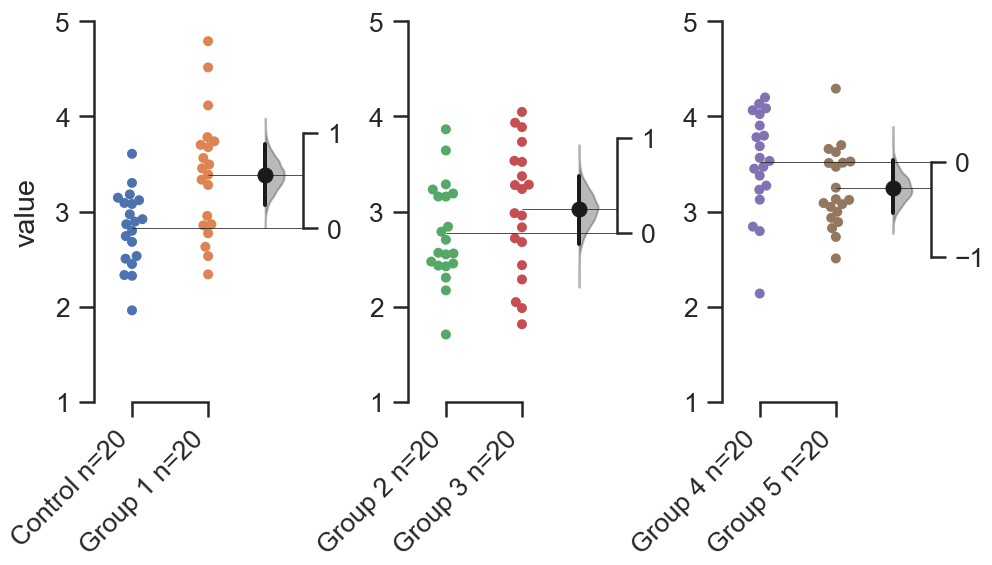

Each two-group experiment has its own floating contrast axes. Another
way to present this is to place all the effect sizes (and their
bootstrap distributions) on a common axes, beneath the raw data. This is
controlled with the ``float_contrast`` option.

.. code-block:: ipython3
   :linenos:

    f6, results6 = dabest.plot(df, idx=(('Control','Group 1'),
                                        ('Group 2','Group 3'),
                                        ('Group 4','Group 5')),
                               float_contrast=False
                              )

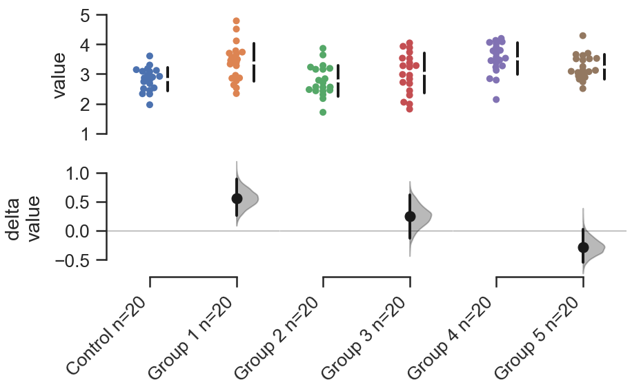

You can also produce a paired multi-group plot, by setting `paired=True`.

.. code-block:: ipython3
   :linenos:

    f6_paired, results6_paired = dabest.plot(df, idx=(('Control','Group 1'),
                                                      ('Group 2','Group 3'),
                                                      ('Group 4','Group 5')),
                                             float_contrast=False,
                                             paired=True
                                            )

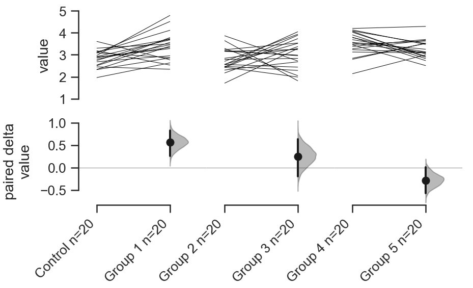

Shared-control estimation plot
==============================

A common experimental setup seen in contemporary biomedical research is
a shared-control design (also known as a 'hub-and-spoke' design), where
two or more experimental groups are compared to a common control group.

A hub-and-spoke plot implements estimation statistics and aesthetics on
such an experimental design.

If more than 2 columns/groups are directly passed to ``idx``, then
``dabest.plot()`` will produce a shared-control estimation plot, where
the first group in the tuple/list is considered the control group. The
mean difference and confidence intervals of each subsequent group will
be computed against the first control group.

.. code-block:: ipython3
   :linenos:

    f7, results7 = dabest.plot(df, idx=('Control', 'Group 2', 'Group 4'),
                       color_col='Gender')

    results7

.. raw:: html

    

    <table border="0" class="dataframe">
      <thead>
        <tr style="text-align: right;">
          <th></th>
          <th>reference_group</th>
          <th>experimental_group</th>
          <th>stat_summary</th>
          <th>bca_ci_low</th>
          <th>bca_ci_high</th>
          <th>ci</th>
          <th>is_difference</th>
          <th>is_paired</th>
          <th>pvalue_2samp_ind_ttest</th>
          <th>pvalue_mann_whitney</th>
        </tr>
      </thead>
      <tbody>
        <tr>
          <th>0</th>
          <td>Control</td>
          <td>Group 2</td>
          <td>-0.049862</td>
          <td>-0.330886</td>
          <td>0.234553</td>
          <td>95.0</td>
          <td>True</td>
          <td>False</td>
          <td>0.734693</td>
          <td>0.714980</td>
        </tr>
        <tr>
          <th>1</th>
          <td>Control</td>
          <td>Group 4</td>
          <td>0.698509</td>
          <td>0.388645</td>
          <td>0.968367</td>
          <td>95.0</td>
          <td>True</td>
          <td>False</td>
          <td>0.000028</td>
          <td>0.000093</td>
        </tr>
      </tbody>
    </table>
    

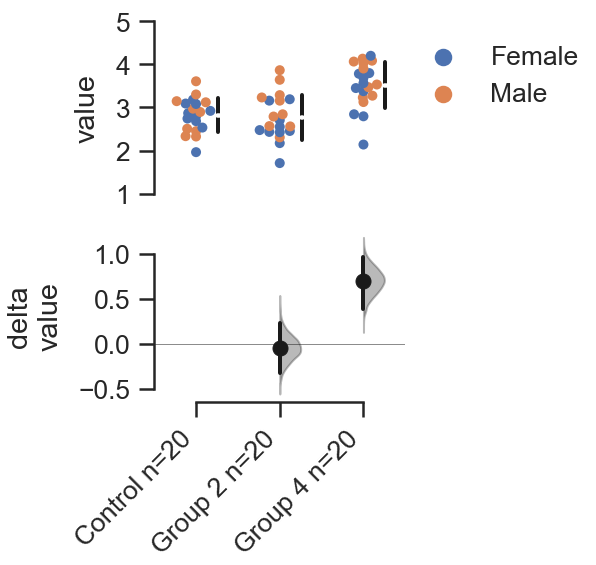

In a shared control plot, the effect sizes and bootstrap 95CIs are shown
on the lower panel for all comparisons. By default, a summary line is
plotted for each group. The mean (indicated by the gap) and the standard
deviation is plotted as a gapped line.

One can display the median with the 25th and 75th percentiles (a
Tufte-style boxplot) using the ``group_summaries`` keyword argument in
the function.

.. code-block:: ipython3
   :linenos:

    f8, results8 = dabest.plot(df, idx=('Control', 'Group 2', 'Group 4'),
                               color_col='Gender',
                               group_summaries='median_quartiles')

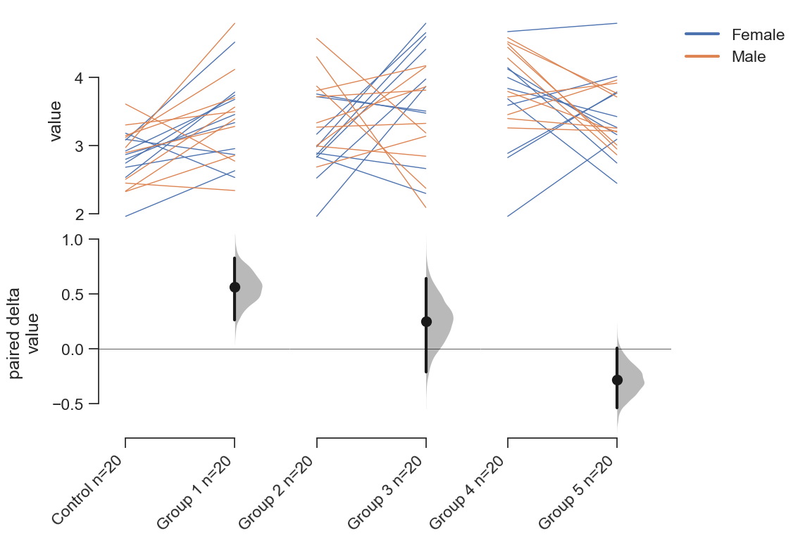

Controlling aesthetics
======================

Below we run through ways of customizing various aesthetic features.

.. code-block:: ipython3
   :linenos:

    # Changing the contrast y-limits.

    f9, results9 = dabest.plot(df, idx=('Control','Group 1','Group 2'),
                               color_col='Gender',
                               contrast_ylim=(-2,2))

.. image:: _images/tutorial_26_0.png

.. code-block:: ipython3
   :linenos:

    # Changing the swarmplot y-limits.

    f10, results10 = dabest.plot(df, idx=('Control', 'Group 1', 'Group 2'),
                                 color_col='Gender',
                                 swarm_ylim=(-10, 10))

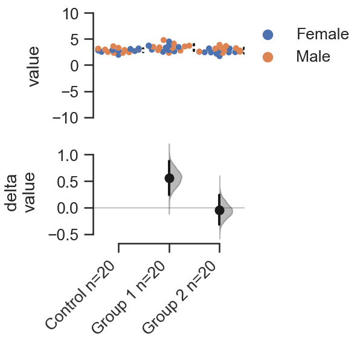

.. code-block:: ipython3
   :linenos:

    # Changing the figure size.
    # The default figure size has been tweaked for
    # optimal visual harmony and proportion in most use cases.
    # You can, however, tweak the figure size.

    f11, results11 = dabest.plot(df, idx=('Control','Group 1','Group 2'),
                                 color_col='Gender',
                                 fig_size=(10, 4) # xy dimensions in inches.
                                )

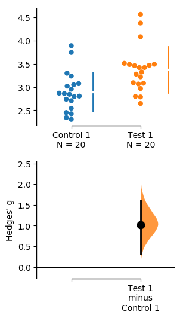

.. code-block:: ipython3
   :linenos:

    # Changing the size and alpha (transparency) of the dots in the swarmplot.
    # This is done through swarmplot_kwargs, which accepts a dictionary.
    # You can pass any keywords that `sns.swarmplot()` can accept.

    f12, results12 = dabest.plot(df, idx=('Control','Group 1','Group 2'),
                                 color_col='Gender',
                                 swarmplot_kwargs={'alpha':0.8,
                                                   'size':6}
                                )

.. image:: _images/tutorial_29_0.png

.. code-block:: ipython3
   :linenos:

    # Custom y-axis labels.
    f13, results13 = dabest.plot(df, idx=('Control','Group 1','Group 2'),
                                 color_col='Gender',
                                 # Insert line breaks manually with `\n`.
                                 swarm_label='My Custom\nSwarm Label',
                                 contrast_label='This is the\nEstimation Plot'
                                )

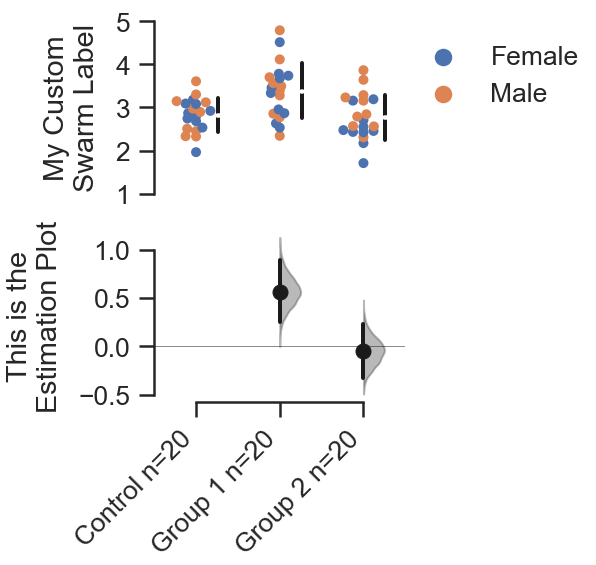

.. code-block:: ipython3
   :linenos:

    # Any of matplotlib's named colors will work.
    # See https://matplotlib.org/examples/color/named_colors.html

    f14, results14 = dabest.plot(df, idx=('Control','Group 1','Group 2'),
                                 color_col='Gender',
                                 # The categories in `color_col` will be
                                 # assigned alphabetically according
                                 # to the order of colors below.
                                 custom_palette=['darkorange', 'slategrey']
                                )

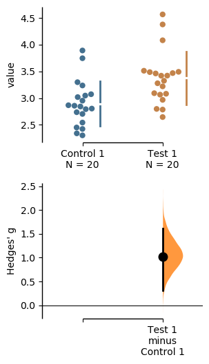

.. code-block:: ipython3
   :linenos:

    # You can also pass colors in the RGB tuple form (r, g, b),
    # or in hexadecimal form (if you're more familiar with HTML color codes).

    f15, results15 = dabest.plot(df, idx=('Control','Group 1','Group 2'),
                                 color_col='Gender',
                                 # Below I pass darkorange in RGB,
                                 # and slategrey in hexadecimal.
                                 custom_palette=[(1.0, 0.549, 0.0), '#708090']
                                )

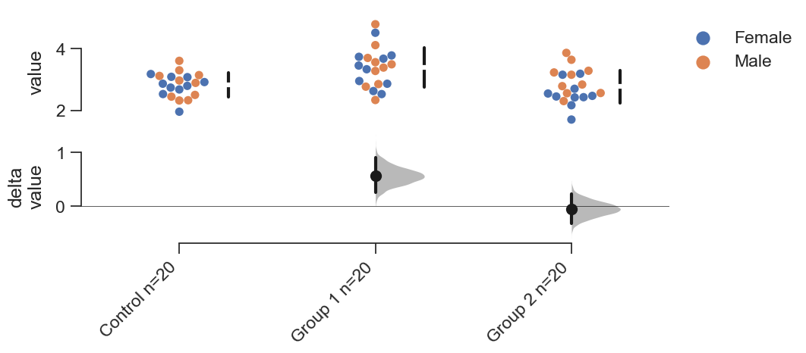

.. code-block:: ipython3
   :linenos:

    # Passing a dict as a custom palette.
    f16, results16 = dabest.plot(df, idx=('Control','Group 1','Group 2'),
                                 color_col='Gender',
                                 custom_palette={'Male':'slategrey',
                                                 'Female':'darkorange'}
                                )

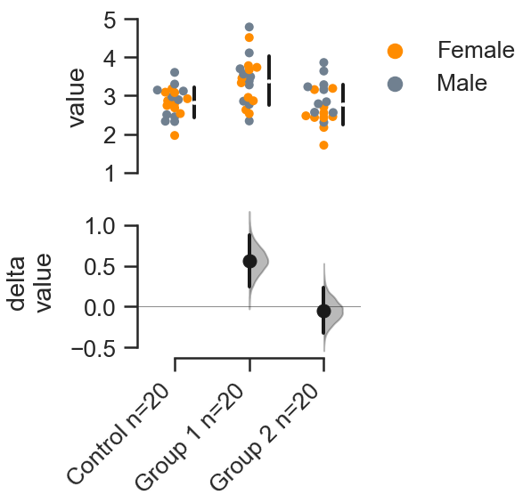

.. code-block:: ipython3
   :linenos:

    # Tweaking the tick length and padding between tick and label.

    f17, results17 = dabest.plot(df, idx=('Control','Group 1','Group 2'),
                                 color_col='Gender',
                                 tick_length=5, tick_pad=5
                                )

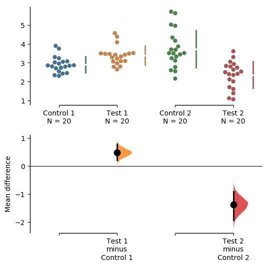

Working with 'melted' DataFrames
=================================

``dabest.plot`` can also work with 'melted' or 'longform' data. This
term is so used because each row will now correspond to a single
datapoint, with one column carrying the value (``value``) and other
columns carrying 'metadata' describing that datapoint (in this case,
``group`` and ``Gender``).

More details on wide vs long or 'melted' data can be found in this `Wikipedia article <https://en.wikipedia.org/wiki/Wide_and_narrow_data>`_. The `pandas documentation <https://pandas.pydata.org/pandas-docs/stable/generated/pandas.melt.html>`_ gives recipes for melting dataframes.

.. code-block:: ipython3
   :linenos:

    x='group'
    y='my_metric'
    color_col='Gender'
    value_cols = df.columns[:-1] # select all but the 'Gender' column.

    df_melt=pd.melt(df.reset_index(),
                    id_vars=['index',color_col],
                    value_vars=value_cols,
                    value_name=y,
                    var_name=x)

    df_melt.head() # Gives the first five rows of `df_melt`.

.. raw:: html

    

    <table border="0" class="dataframe">
      <thead>
        <tr>
          <th></th>
          <th>index</th>
          <th>Gender</th>
          <th>group</th>
          <th>my_metric</th>
        </tr>
      </thead>
      <tbody>
        <tr>
          <th>0</th>
          <td>0</td>
          <td>Female</td>
          <td>Control</td>
          <td>2.742313</td>
        </tr>
        <tr>
          <th>1</th>
          <td>1</td>
          <td>Female</td>
          <td>Control</td>
          <td>2.681590</td>
        </tr>
        <tr>
          <th>2</th>
          <td>2</td>
          <td>Female</td>
          <td>Control</td>
          <td>3.180724</td>
        </tr>
        <tr>
          <th>3</th>
          <td>3</td>
          <td>Female</td>
          <td>Control</td>
          <td>1.961873</td>
        </tr>
        <tr>
          <th>4</th>
          <td>4</td>
          <td>Female</td>
          <td>Control</td>
          <td>2.867556</td>
        </tr>
      </tbody>
    </table>
    

If you are using a melted DataFrame, you will need to specify the ``x``
(containing the categorical group names) and ``y`` (containing the
numerical values for plotting) columns.

.. code-block:: ipython3
   :linenos:

    f17, results17 = dabest.plot(df_melt,
                                 x='group',
                                 y='my_metric',
                                 idx=('Control','Group 1'),
                                 color_col='Gender'
                                )
    results17

.. raw:: html

    

    </style>
    <table border="0" class="dataframe">
      <thead>
        <tr style="text-align: right;">
          <th></th>
          <th>reference_group</th>
          <th>experimental_group</th>
          <th>stat_summary</th>
          <th>bca_ci_low</th>
          <th>bca_ci_high</th>
          <th>ci</th>
          <th>is_difference</th>
          <th>is_paired</th>
          <th>pvalue_2samp_ind_ttest</th>
          <th>pvalue_mann_whitney</th>
        </tr>
      </thead>
      <tbody>
        <tr>
          <th>0</th>
          <td>Control</td>
          <td>Group 1</td>
          <td>0.564092</td>
          <td>0.244025</td>
          <td>0.889509</td>
          <td>95.0</td>
          <td>True</td>
          <td>False</td>
          <td>0.001811</td>
          <td>0.004703</td>
        </tr>
      </tbody>
    </table>
    

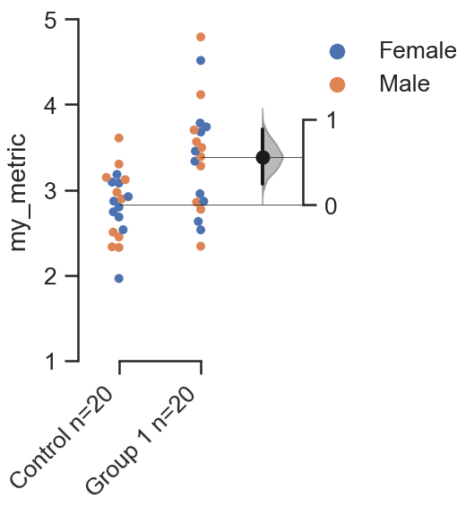
